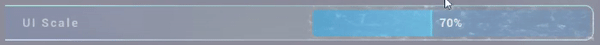

# Realizzare una schermata di Game Settings (sulla base del progetto Lyra di Epic Games)
Guida in Unreal Engine 5 per realizzare una schermata di Game Settings modulare e componibile sulla base di come viene realizzata nel progetto [*Lyra* di **Epic Games**](https://www.unrealengine.com/marketplace/en-US/product/lyra).

**Note:**
- I nomi delle classi `cpp` e dei Blueprint fanno riferimento a un progetto che come iniziali `PR`, perciò hanno tutte il prefisso `PR`, da sostituire con il nome/iniziali del proprio progetto;
- Molto spesso i nomi degli elementi all'interno dei Widget Blueprint devono corrispondere esattamente a quelli di *Lyra* per il corretto funzionamento, quindi si raccomanda di rinominare tutti gli elementi come riportato in questa guida;
- È consigliabile seguire la guida nell'ordine proposto, poiché molti passaggi sono indispensabili prima dei successivi.
## 1. Preparazione 
### 1.1. Aggiungere i Plugin
Per il funzionamento del sistema è necessario riportare i seguenti plugin dal `LyraStarterGame` nel proprio progetto:
- `CommonGame`
- `CommonUser`
- `GameSettings`
- `ModularGameplayActors`


Per farlo basta copiare e incollare le 4 cartelle dalla cartella `Plugins` di *Lyra* alla cartella `Plugins` del progetto (se non esiste, basterà crearla).
### 1.2. Aggiungere i Gameplay Modules
Sono necessari i seguenti moduli per il corretto funzionamento del sistema, da aggiungere alle dipendenze pubbliche del file `ProjectName.Build.cs`:
- `GameplayTags`
- `EnhanchedInput`
- `CommonUI`
- `CommonInput`
- `CommonGame`
- `GameSettings`
- `UMG`

```cs
//ProjectName.Build.cs
//...
PublicDependencyModuleNames.AddRange(new string[] { "Core", "CoreUObject", "Engine", "InputCore", "SlateCore", "DeveloperSettings",
"GameplayTags", "EnhancedInput", "CommonUI", "CommonInput", "CommonGame", "GameSettings", "UMG" });
//...
```
### 1.3. Settare la Common UI
Il sistema di *Lyra* si basa sulla `CommonUI`, perciò è necessario impostare il progetto in modo che possa essere utilizzata.
#### 1.3.1. Viewport
Andare in `Edit → Project Settings → Engine → General Settings` e cambiare la `Game Viewport Client Class` in `CommonGameViewportClient`:


È anche possibile creare una classe personalizzata che derivi dalla classe `CommonGameViewportClient`.
#### 1.3.2. Policy
Andare su `Tools → New C++ Class` per creare una nuova classe C++ denominata `PRUIManagerSubsystem` che eredita dalla classe `GameUIManagerSubsystem`, con il seguente codice:

```cpp
//PRUIManagerSubsystem.h

#include "CoreMinimal.h"  
#include "GameUIManagerSubsystem.h"  
#include "PRUIManagerSubsystem.generated.h"  
  
UCLASS()  
class UPRUIManagerSubsystem : public UGameUIManagerSubsystem  
{  
    GENERATED_BODY()  
    
public:  
  
    UPRUIManagerSubsystem();  
  
    virtual void Initialize(FSubsystemCollectionBase& Collection) override;  
};
```

```cpp
//PRUIManagerSubsystem.cpp

#include "Settings/PRUIManagerSubsystem.h"  
#include "Engine/GameInstance.h"  
  
class FSubsystemCollectionBase;  
  
UPRUIManagerSubsystem::UPRUIManagerSubsystem()  
{  
}  
  
void UPRUIManagerSubsystem::Initialize(FSubsystemCollectionBase& Collection)  
{  
    Super::Initialize(Collection); 
}
```

Dopodiché, creare un nuovo Blueprint che eredita da `GameUIPolicy`, dal nome `BP_PRUIPolicy` e, per ora, lasciarlo vuoto.

Copiare poi la reference di questo nuovo asset tramite `click destro sull'asset → Copy Reference`:


Estrarre dalla reference solo la parte tra gli apici, ovvero da `/Script/Engine.Blueprint'/Game/Developers/camil/LyraSettingsTest/BP_PRUIPolicy.BP_PRUIPolicy'` copiare solo `/Game/Developers/camil/LyraSettingsTest/BP_PRUIPolicy.BP_PRUIPolicy`, che servirà nel prossimo passaggio, ricordandosi poi di aggiungere "`_C`" alla fine.

Nel file di configurazione `DefaultGame.ini`, è necessario inserire la seguente impostazione:

```ini
//DefaultGame.ini
[/Script/ProjectName.PRUIManagerSubsystem]  
DefaultUIPolicyClass=/Game/Developers/camil/LyraSettingsTest/BP_PRUIPolicy.BP_PRUIPolicy_C
```

Sostituendo ovviamente `[/Script/ProjectName.PRUIManagerSubsystem]` con `[/Script/NomeProgetto.PRUIManagerSubsystem]` e il path della `DefaultUIPolicyClass` con quello appena copiato (con l'aggiunta del "`_C`" finale).

Ora è possibile creare ciò che andrà a riempire il Blueprint `BP_PRUIPolicy`, ovvero un Widget che contiene tutti gli stack tipici della CommonUI, ma prima è necessario creare dei Gameplay Tags per identificare i suddetti stack. Per fare questo, creare una nuova Data Table per contenerli, dal nome `DT_UILayerTags`, facendo `click destro su un punto vuoto del Content Drawer → Miscellaneous → Data Table`:


Selezionando `GameplayTagTableRow` come struttura per le righe:


E creando poi all'interno 4 righe con i seguenti tag:
- `UI.Layer.Game`
- `UI.Layer.GameMenu`
- `UI.Layer.Menu` (quello che verrà utilizzato per il menu di Game Settings)
- `UI.Layer.Modal`


Inserire poi i tag all'interno dei Project Settings, andando su `Edit → Project Settings → Project → Gameplay Tags` e inserire il nuovo asset nella `Gameplay Tag Table List`:


Ora è finalmente possibile creare il widget `WBP_OverallLayout`, figlio di `PrimaryGameLayout`, facendo `click destro su un punto vuoto del Content Drawer → User Interface → Widget Blueprint`:


E cercando poi `PrimaryGameLayout` tra le classi disponibili:


Creare quindi i seguenti elementi all'interno del Widget:
- `MainOverlay`, di tipo `Overlay`
	- `GameLayer_Stack`, di tipo `CommonActivatableWidgetStack`
	- `GameMenu_Stack`, di tipo `CommonActivatableWidgetStack`
	- `Menu_Stack`, di tipo `CommonActivatableWidgetStack`
	- `Modal_Stack`, di tipo `CommonActivatableWidgetStack`


E inserire i seguenti nodi nel `Graph`:

> [!IMPORTANT]
> **WBP_OverallLayout**: [Open Graph on BlueprintUE](https://blueprintue.com/blueprint/hmde6isd/)

Ora è possibile inserire questo Widget all'interno della policy creata prima, perciò all'interno dell'asset `BP_PRUIPolicy` va impostata la `LayoutClass` con il `WBP_OverallLayout`:


> [!CAUTION]
> Potrebbe capitare che, al cambio della `Layout Class`, l'engine vada in **crash** con il seguente errore:
> 
> ```
> [File:D:\build\++UE5\Sync\Engine\Source\Runtime\CoreUObject\Private\Templates\Casts.cpp] 
> [Line: 10] Cast of Package /Game/GameSettings/BP_PRUIPolicy to GameUIManagerSubsystem failed
> ```
> 
> A quanto pare è un errore legato ai livelli *Open World*, come si evince dal commento dell'utente ***spvnn*** in [questa](https://forums.unrealengine.com/t/using-lyras-commongame-plugin-in-another-project-crashes-when-setting-layout-class-in-gameuipolicy/1708137/5) discussione, che affliggerebbe lo stesso progetto *Lyra*.
> 
> Un possibile e temporaneo *workaround* è quello di utilizzarlo in livelli che non siano *open world*.
#### 1.3.3. Common Input
Creare innanzitutto due `DataTable` per le azioni di input, entrambe con una `Row Structure` di tipo `CommonInputActionDataBase`:

1. `DT_UniversalActions`:
	- Riga `DefaultBack` per tornare indietro:
	   
	   
	   Si noti che è stato utilizzato il tasto `L` per tornare indietro per evitare di utilizzare `Esc` (che fa uscire dalla play mode), ma sarebbe più corretto utilizzare `Esc`. È anche possibile impostare un tasto da associare al Gamepad.
	   La `Nav Bar Priority` serve per definire l'ordine in cui il pulsante apparirà nella UI. Impostando il tasto `Back` su `1` e tutti gli altri tasti su `0`, si impone che il tasto `Back` sia l'ultimo (sulla base di come verrà strutturato il widget). 
	   
	- Riga `DefaultForward` per andare avanti (in realtà ancora non utilizzata nella pratica, ma per evitare messaggi di Warning è utile inserirla):
	   
	   
2. `DT_SaveActions` (servirà più avanti, nella [sezione 3.2.4](https://github.com/CamillaBianca/UE5_LyraGameSettings/blob/main/README.md#324-assemblare-il-game-settings-screen)):
	- Riga `ApplyChanges` per applicare i cambiamenti quando verranno selezionati nel menu:
	   
	   
	   Si noti che il `Display Name` rappresenta il nome che apparirà sul bottone corrispondente.
	   
	- Riga `CancelChanges` per annullare i cambiamenti quando verranno selezionati nel menu, ancora non salvati:
	   

Dopodiché è necessario creare un nuovo Blueprint (nominato `B_CommonInputData`) figlio di `CommonUIInputData` e inserire al suo interno le righe della prima DataTable appena creata:


A questo punto bisogna impostare questo nuovo asset come `Input Data` andando su `Edit → Project Settings → Game → Common Input Settings`:


Come ultima cosa, assicurarsi che nel file `DefaultGame.ini` ci sia la seguente impostazione:

```ini
//DefaultGame.ini
[/Script/CommonInput.CommonInputSettings]  
InputData=/Game/Developers/camil/LyraSettingsTest/B_CommonInputData.B_CommonInputData_C
```

Sostituendo ovviamente  il path di `InputData` copiando la reference dell'asset `B_CommonInputData`, ricordandosi di prendere solo la parte tra gli apici, come visto nella [sezione precedente riguardante la ***Policy***](https://github.com/CamillaBianca/UE5_LyraGameSettings/tree/main?tab=readme-ov-file#132-policy).
#### 1.3.4. Common Game Instance
Per il corretto funzionamento della CommonUI, è necessario creare un nuovo Blueprint figlio di `CommonGameInstance`, chiamato `PRCommonGameInstance`, e inserirlo nel file di configurazione `DefaultEngine.ini`:

```ini
//DefaultEngine.ini
[/Script/EngineSettings.GameMapsSettings]
//...
GameInstanceClass=/Game/Developers/camil/LyraSettingsTest/PRCommonGameInstance.PRCommonGameInstance_C
```

Ovviamente prendendo sempre il percorso dell'asset tramite `click destro → Copy Reference`, copiando solo la parte tra gli apici e aggiungendo la parte "`_C`" finale, come visto nella [sezione precedente riguardante la ***Policy***](https://github.com/CamillaBianca/UE5_LyraGameSettings/tree/main?tab=readme-ov-file#132-policy).
#### 1.3.5. Local Player
Un'altra modifica da apportare per avere una CommonUI funzionante riguarda il Local Player. Creare quindi una nuova classe C++ da `Tools → New C++ Class`, denominata `PRLocalPlayer`, figlia della classe `CommonLocalPlayer`:

```cpp
//PRLocalPlayer.h

#include "CoreMinimal.h"  
#include "CommonLocalPlayer.h"  
#include "PRLocalPlayer.generated.h"  
  
class UPRSettingsLocal;  
class UPRSettingsShared;  
  
UCLASS()  
class PROJECTNAME_API UPRLocalPlayer : public UCommonLocalPlayer  
{  
    GENERATED_BODY()  
  
public:  
    UPRLocalPlayer();  
  
    /** Gets the local settings for this player, this is read from config files at process startup and is always valid */  
    UFUNCTION()  
    UPRSettingsLocal* GetLocalSettings() const;  
  
    /** Gets the shared setting for this player, this is read using the save game system so may not be correct until after user login */  
    UFUNCTION()  
    UPRSettingsShared* GetSharedSettings() const;  
  
private:  
    UPROPERTY(Transient)  
    mutable TObjectPtr<UPRSettingsShared> SharedSettings;
};
```

```cpp
//PRLocalPlayer.cpp

#include "Settings/PRLocalPlayer.h"   
#include "Settings/PRSettingsLocal.h"  
#include "Settings/PRSettingsShared.h"  
  
#include UE_INLINE_GENERATED_CPP_BY_NAME(PRLocalPlayer)  
  
UPRLocalPlayer::UPRLocalPlayer()  
{
}  
  
UPRSettingsLocal* UPRLocalPlayer::GetLocalSettings() const  
{  
    return UPRSettingsLocal::Get();  
}
  
UPRSettingsShared* UPRLocalPlayer::GetSharedSettings() const  
{
    if (!SharedSettings)  
    {       
	   // On PC it's okay to use the sync load because it only checks the disk  
       bool bCanLoadBeforeLogin = PLATFORM_DESKTOP;  
  
       if (bCanLoadBeforeLogin)  
       {
	       SharedSettings = UPRSettingsShared::LoadOrCreateSettings(this);  
       }
       else  
       {  
          // We need to wait for user login to get the real settings so return temp ones
          SharedSettings = UPRSettingsShared::CreateTemporarySettings(this);  
       }
    }
	return SharedSettings;  
}
```

Nella sezione successiva vengono approfonditi i concetti di `LocalSettings` e `SharedSettings`, ed è spiegato come inserirli nel progetto.

Infine, selezionare `PRLocalPlayer`  come `Local Player Class` del progetto, andando su `Edit → Project Settings → Engine → General Settings`:


#### 1.3.6. Game Mode
L'ultima modifica necessaria per il corretto funzionamento della CommonUI prevede di aggiungere una Game Mode personalizzata, che può ereditare dalla classe `Game Mode Base` (o anche `Modular Game Mode Base`), con le seguenti impostazioni:


È importante settare:
- Il proprio character come `Default Pawn Class`;
- Un Player Controller che erediti da `CommonPlayerController` (nell'immagine qui sopra `PRCommonPlayerController`) o direttamente il `CommonPlayerController` nella `Player Controller Class`.
## 2. Settings Core
### 2.1. Classi per i Settings (locali e condivisi)
All'interno del `PRLocalPlayer` vengono mantenuti i riferimenti a due nuove classi, che si occupano di gestire i singoli Settings e ciò che ne concerne, ovvero:
- Il tipo di settaggio (è presente una [sezione dedicata che spiega i diversi tipi](https://github.com/CamillaBianca/UE5_LyraGameSettings/tree/main?tab=readme-ov-file#2211-possibili-tipi-di-settings));
- Le funzioni `getter` e `setter` (oltre che eventuali altre funzioni utili per gestirli);
- Le logiche dietro al cambio dei settings, ovvero cosa succede se viene impostata un'opzione piuttosto che un'altra.

Le classi sono:
1. `PRSettingsLocal`, che eredita da `GameUserSettings`: contiene tutte le impostazioni relative alla macchina del giocatore, quindi tutte le funzionalità che riguardano il dispositivo su cui si gioca. Ad esempio:
	- Impostazioni del display e della qualità grafica;
	- V-Sync;
	- Limiti di Frame Rate;
	- Impostazioni audio;
	- Associazioni personalizzate dei tasti.
2. `PRSettingsShared`, che eredita da `LocalPlayerSaveGame`: contiene tutte le impostazioni relative al giocatore o al gioco stesso che possono essere condivise in un eventuale cloud. Ad esempio:
	- Difficoltà del gameplay;
	- Impostazioni di accessibilità (come le modalità daltonismo o i sottotitoli);
	- Sensibilità del mouse.

Non è ancora chiarissima l'utilità di suddividere i Settings in due classi separate, *Lyra* probabilmente lo fa per gestire anche le funzionalità in multiplayer, oppure i salvataggi in cloud.
#### 2.1.1. Local Settings
Rappresentano uno dei due tipi di Settings gestiti da *Lyra*, ovvero quelli relativi alla macchina su cui il gioco viene eseguito. Sono salvati e gestiti all'interno del Local Player, e per usarli bisogna creare la nuova classe `PRSettingsLocal`, figlia della classe `GameUserSettings`:

```cpp
//PRSettingsLocal.h

#include "CoreMinimal.h"  
#include "GameFramework/GameUserSettings.h"  
#include "UserSettings/PRDeveloperSettings.h"
#include "PRSettingsLocal.generated.h"  
  
class UPRLocalPlayer;  
  
// Subtitles Struct 
UENUM(BlueprintType)  
enum class ESubtitleTextFont : uint8  
{  
    Arial,  
    CourierNew,  
    Roboto,  
    ESubtitleTextFont_MAX  
};  
  
UENUM(BlueprintType)  
enum class ESubtitleLanguage : uint8  
{  
    English,  
    French,  
    German,  
    Italian,  
    Spanish,  
    ESubtitleLanguage_MAX  
};  
  
UENUM(BlueprintType)  
enum class ESubtitleTextSize : uint8  
{  
    Small,  
    Medium,  
    Large,  
    ESubtitleTextSize_MAX  
};  
  
UENUM(BlueprintType)  
enum class ESubtitleTextColor : uint8  
{  
    White,  
    Yellow,  
    LightBlue,  
    ESubtitleTextColor_MAX  
};  
  
UENUM(BlueprintType)  
enum class ESubtitleTextBorder : uint8  
{  
    None,  
    Small,  
    Medium,  
    Large,  
    ESubtitleTextBorder_MAX  
};  
  
UENUM(BlueprintType)  
enum class ESubtitleBackgroundOpacity : uint8  
{  
    Clear,  
    Low,  
    Medium,  
    High,  
    Solid,  
    ESubtitleBackgroundOpacity_MAX  
};

USTRUCT(BlueprintType)  
struct FSubtitlesSettings  
{  
    GENERATED_BODY()  
  
    UPROPERTY(Config, EditAnywhere, BlueprintReadWrite, Category="Subtitles Settings")  
    bool bEnableSubtitles = false;  
  
    UPROPERTY(Config, EditAnywhere, BlueprintReadWrite, Category="Subtitles Settings")  
    ESubtitleTextFont TextFont;  
  
    UPROPERTY(Config, EditAnywhere, BlueprintReadWrite, Category="Subtitles Settings")  
    ESubtitleTextSize TextSize;  
  
    UPROPERTY(Config, EditAnywhere, BlueprintReadWrite, Category="Subtitles Settings")  
    ESubtitleTextColor TextColor;  
  
    UPROPERTY(Config, EditAnywhere, BlueprintReadWrite, Category="Subtitles Settings")  
    ESubtitleTextBorder TextBorder;  
  
    UPROPERTY(Config, EditAnywhere, BlueprintReadWrite, Category="Subtitles Settings")  
    ESubtitleBackgroundOpacity BackgroundOpacity;  
};  
// END Subtitles Struct 
  
UCLASS(Config=Game)  
class PROJECTNAME_API UPRSettingsLocal : public UGameUserSettings  
{  
    GENERATED_BODY()  
  
public:  
    UPRSettingsLocal();  
  
    static UPRSettingsLocal* Get();  
  
    // Subtitles 
private:  
  
    UPROPERTY(Config, EditAnywhere, Category="Subtitles Settings")  
    FSubtitlesSettings SubtitlesSettings;  
  
public:  
  
    UFUNCTION(BlueprintCallable)  
    void SetEnableSubtitles(bool bEnableSubtitles);  
  
    UFUNCTION(BlueprintCallable)  
    bool GetEnableSubtitles() const;  
  
    UFUNCTION(BlueprintCallable)  
    void SetSubtitlesTextFont(ESubtitleTextFont TextFont);  
  
    UFUNCTION(BlueprintCallable)  
    ESubtitleTextFont GetSubtitlesTextFont() const;  
  
    UFUNCTION(BlueprintCallable)  
    void SetSubtitlesTextSize(ESubtitleTextSize TextSize);  
  
    UFUNCTION(BlueprintCallable)  
    ESubtitleTextSize GetSubtitlesTextSize() const;  
  
    UFUNCTION(BlueprintCallable)  
    void SetSubtitlesTextColor(ESubtitleTextColor TextColor);  
  
    UFUNCTION(BlueprintCallable)  
    ESubtitleTextColor GetSubtitlesTextColor() const;  
  
    UFUNCTION(BlueprintCallable)  
    void SetSubtitlesTextBorder (ESubtitleTextBorder TextBorder);  
  
    UFUNCTION(BlueprintCallable)  
    ESubtitleTextBorder GetSubtitlesTextBorder() const;  
  
    UFUNCTION(BlueprintCallable)  
    void SetSubtitlesBackgroundOpacity (ESubtitleBackgroundOpacity BackgroundOpacity);  
  
    UFUNCTION(BlueprintCallable)  
    ESubtitleBackgroundOpacity GetSubtitlesBackgroundOpacity() const;  
  
    // END Subtitles
    virtual void SetToDefaults() override;  
  
    // Test Settings: ShouldUseArachnophobiaMode and UIScale (don't do anything)
public:  
    UFUNCTION()  
    bool ShouldUseArachnophobiaMode() const { return bShouldUseArachnophobiaMode; }  
    UFUNCTION()  
    void SetShouldUseArachnophobiaMode(bool bEnabled) { bShouldUseArachnophobiaMode = bEnabled; }  
  
    UFUNCTION()  
    int32 GetUIScale() const { return UIScalePercent; }  
    UFUNCTION()  
    void SetUIScale(float InUIScale) { UIScalePercent = InUIScale; }  
  
private:  
    UPROPERTY(Config)  
    bool bShouldUseArachnophobiaMode = false;  
    UPROPERTY(Config)  
    int32 UIScalePercent = 100;  
  
    // END Test Settings  
  
    // Brightness/Gamma
public:
    UFUNCTION()  
    float GetDisplayGamma() const;  
    UFUNCTION()  
    void SetDisplayGamma(float InGamma);  
  
private:  
    void ApplyDisplayGamma();  
    UPROPERTY(Config)  
    float DisplayGamma = 2.2;  
};
```

```cpp
//PRSettingsLocal.cpp

#include "Settings/PRSettingsLocal.h"  
  
#include UE_INLINE_GENERATED_CPP_BY_NAME(PRSettingsLocal)  
  
PRAGMA_DISABLE_DEPRECATION_WARNINGS  
UPRSettingsLocal::UPRSettingsLocal()  
{  
    //SetToDefaults();  
}  
  
UPRSettingsLocal* UPRSettingsLocal::Get()  
{  
    return GEngine ? CastChecked<UPRSettingsLocal>(GEngine->GetGameUserSettings()) : nullptr;  
}  
  
void UPRSettingsLocal::SetToDefaults()  
{  
    Super::SetToDefaults();  
    bShouldUseArachnophobiaMode = false;  
    UIScalePercent = 100;  
    SetEnableSubtitles(true);  
    SetSubtitlesTextFont(ESubtitleTextFont::Arial);  
    SetSubtitlesTextSize(ESubtitleTextSize::Medium);  
    SetSubtitlesTextColor(ESubtitleTextColor::Yellow);  
    SetSubtitlesTextBorder(ESubtitleTextBorder::Medium);  
    SetSubtitlesBackgroundOpacity(ESubtitleBackgroundOpacity::Medium);  
}  
  
// Subtitles
  
void UPRSettingsLocal::SetEnableSubtitles(bool bEnableSubtitles)  
{  
    SubtitlesSettings.bEnableSubtitles = bEnableSubtitles;  
}  
  
bool UPRSettingsLocal::GetEnableSubtitles() const  
{  
    return SubtitlesSettings.bEnableSubtitles;  
}
  
void UPRSettingsLocal::SetSubtitlesTextFont(ESubtitleTextFont TextFont)  
{  
    SubtitlesSettings.TextFont = TextFont;  
}  
  
ESubtitleTextFont UPRSettingsLocal::GetSubtitlesTextFont() const  
{  
    return SubtitlesSettings.TextFont;  
}  
  
void UPRSettingsLocal::SetSubtitlesTextSize(ESubtitleTextSize TextSize)  
{  
    SubtitlesSettings.TextSize = TextSize;  
}  
  
ESubtitleTextSize UPRSettingsLocal::GetSubtitlesTextSize() const  
{  
    return SubtitlesSettings.TextSize;  
}  
  
void UPRSettingsLocal::SetSubtitlesTextColor(ESubtitleTextColor TextColor)  
{  
    SubtitlesSettings.TextColor = TextColor;  
}  
  
ESubtitleTextColor UPRSettingsLocal::GetSubtitlesTextColor() const  
{  
    return SubtitlesSettings.TextColor;  
}  
  
void UPRSettingsLocal::SetSubtitlesTextBorder(ESubtitleTextBorder TextBorder)  
{  
    SubtitlesSettings.TextBorder = TextBorder;  
}  
  
ESubtitleTextBorder UPRSettingsLocal::GetSubtitlesTextBorder() const  
{  
    return SubtitlesSettings.TextBorder;  
}  
  
void UPRSettingsLocal::SetSubtitlesBackgroundOpacity(ESubtitleBackgroundOpacity BackgroundOpacity)  
{  
    SubtitlesSettings.BackgroundOpacity = BackgroundOpacity;  
}  
  
ESubtitleBackgroundOpacity UPRSettingsLocal::GetSubtitlesBackgroundOpacity() const  
{  
    return SubtitlesSettings.BackgroundOpacity;  
}  
// END Subtitles
  
// Brightness/Gamma  
float UPRSettingsLocal::GetDisplayGamma() const  
{  
    return DisplayGamma;  
}  
  
void UPRSettingsLocal::SetDisplayGamma(float InGamma)  
{  
    DisplayGamma = InGamma;  
    ApplyDisplayGamma();  
}  
  
void UPRSettingsLocal::ApplyDisplayGamma()  
{  
    if (GEngine)  
    {
	    GEngine->DisplayGamma = DisplayGamma;  
	}
}
```

In questo caso di test è stato deciso di inserire i seguenti Settings *locali*:
- Una struttura per i sottotitoli (che ha un comportamento gestito in un'altra classe non riportata in questa guida perché al di fuori del suo scopo). La struttura contiene diverse impostazioni relative ai sottotitoli:
	- Sottotitoli attivati/disattivati;
	- Font del testo;
	- Dimensione del testo;
	- Colore del testo;
	- Bordo del testo;
	- Opacità dello sfondo del testo.
- Un settaggio booleano per usare o meno la modalità aracnofobia (non fa nulla, è solo per test);
- Un settaggio numerico per la dimensione (scala) della UI (anch'esso solo per test, senza conseguenze);
- Il settaggio della Gamma, ovvero della luminosità dello schermo.
##### 2.1.1.1. Aggiornare il file DefaultEngine.ini
Per rendere validi i salvataggi dei Local Settings, è necessario inserire la classe `PRSettingsLocal` come `GameUserSettingsClassName` nel file `DefaultEngine.ini`:

```ini
//DefaultEngine.ini
//...
[/Script/Engine.Engine]
GameUserSettingsClassName=/Script/NomeProgetto.PRSettingsLocal
//...
LocalPlayerClassName=/Script/NomeProgetto.PRLocalPlayer
GameViewportClientClassName=/Script/CommonUI.CommonGameViewportClient
```
#### 2.1.2. Shared Settings
Rappresentano uno dei due tipi di Settings gestiti da *Lyra*, ovvero quelli relativi al giocatore e al gioco stesso. Sono salvati e gestiti all'interno del Local Player, e per usarli bisogna creare la nuova classe `PRSettingsShared`, figlia della classe `LocalPlayerSaveGame`:

```cpp
//PRSettingsShared.h

#include "CoreMinimal.h"  
#include "GameFramework/SaveGame.h"  
#include "UObject/ObjectPtr.h"  
#include "PRSettingsShared.generated.h"  
  
class UPRLocalPlayer;  
  
UENUM(BlueprintType)  
enum class EDifficultySetting : uint8  
{  
    Easy,  
    Normal,  
    Hard  
};  
  
UCLASS()  
class PROJECTNAME_API UPRSettingsShared : public ULocalPlayerSaveGame  
{  
    GENERATED_BODY()  
public:  
    UPRSettingsShared();  
  
    /** Creates a temporary settings object, this will be replaced by one loaded from the user's save game */  
    static UPRSettingsShared* CreateTemporarySettings(const UPRLocalPlayer* LocalPlayer);  
    /** Synchronously loads a settings object, this is not valid to call before login */  
    static UPRSettingsShared* LoadOrCreateSettings(const UPRLocalPlayer* LocalPlayer);  
  
    /** Saves the settings to disk */  
    void SaveSettings();  
  
    /** Applies the current settings to the player */  
    void ApplySettings();  
  
    // Test Settings: Difficulty (doesn't do anything)
public:  
    UFUNCTION()  
    EDifficultySetting GetDifficulty() const;  
  
    UFUNCTION()  
    void SetDifficulty (EDifficultySetting InDifficulty);  
  
private:  
    UPROPERTY()  
    EDifficultySetting Difficulty = EDifficultySetting::Normal;
    
public:  
    UFUNCTION()  
    int32 GetNumberOfPlayers() const;  
  
    UFUNCTION()  
    void SetNumberOfPlayers(int32 NumOfPlayers);  
  
private:  
    UPROPERTY()  
    int32 NumberOfPlayers = 1;
    // END Test Settings
};
```

```cpp
//PRSettingsShared.cpp

#include "Settings/PRSettingsShared.h"  
#include "Framework/Application/SlateApplication.h"  
#include "Misc/App.h"  
#include "Misc/ConfigCacheIni.h"  
#include "Settings/PRLocalPlayer.h"  
#include "Rendering/SlateRenderer.h"  
#include "EnhancedInputSubsystems.h"  
#include "UserSettings/EnhancedInputUserSettings.h"  
  
#include UE_INLINE_GENERATED_CPP_BY_NAME(PRSettingsShared)  
  
static FString SHARED_SETTINGS_SLOT_NAME = TEXT("SharedGameSettings");  
  
UPRSettingsShared::UPRSettingsShared()  
{  
  
}  
  
UPRSettingsShared* UPRSettingsShared::CreateTemporarySettings(const UPRLocalPlayer* LocalPlayer)  
{  
    // This is not loaded from disk but should be set up to save  
    UPRSettingsShared* SharedSettings = Cast<UPRSettingsShared>(CreateNewSaveGameForLocalPlayer(UPRSettingsShared::StaticClass(), LocalPlayer, SHARED_SETTINGS_SLOT_NAME));  
        SharedSettings->ApplySettings();  
  
    return SharedSettings;  
}  
  
UPRSettingsShared* UPRSettingsShared::LoadOrCreateSettings(const UPRLocalPlayer* LocalPlayer)  
{  
    // This will stall the main thread while it loads  
    UPRSettingsShared* SharedSettings = Cast<UPRSettingsShared>(LoadOrCreateSaveGameForLocalPlayer(UPRSettingsShared::StaticClass(), LocalPlayer, SHARED_SETTINGS_SLOT_NAME));  
  
    SharedSettings->ApplySettings();  
  
    return SharedSettings;  
}  
  
void UPRSettingsShared::SaveSettings()  
{  
    // Schedule an async save because it's okay if it fails  
    AsyncSaveGameToSlotForLocalPlayer();  
    if (UEnhancedInputLocalPlayerSubsystem* System = ULocalPlayer::GetSubsystem<UEnhancedInputLocalPlayerSubsystem>(OwningPlayer))  
    {       if (UEnhancedInputUserSettings* InputSettings = System->GetUserSettings())  
       {          InputSettings->AsyncSaveSettings();  
       }    }}  
  
void UPRSettingsShared::ApplySettings()  
{  
    if (UEnhancedInputLocalPlayerSubsystem* System = ULocalPlayer::GetSubsystem<UEnhancedInputLocalPlayerSubsystem>(OwningPlayer))  
    {       if (UEnhancedInputUserSettings* InputSettings = System->GetUserSettings())  
       {          InputSettings->ApplySettings();  
       }    }}  
  
// Test Settings
EDifficultySetting UPRSettingsShared::GetDifficulty() const  
{  
    return Difficulty;  
}  
  
void UPRSettingsShared::SetDifficulty(EDifficultySetting InDifficulty)  
{  
    if (Difficulty != InDifficulty)  
    {       Difficulty = InDifficulty;  
       // Put logic here for whatever difficulty entails  
    }  
}  

int32 UPRSettingsShared::GetNumberOfPlayers() const  
{  
    return NumberOfPlayers;  
}  
  
void UPRSettingsShared::SetNumberOfPlayers(int32 NumOfPlayers)  
{  
    if (NumberOfPlayers != NumOfPlayers)  
    {       NumberOfPlayers = NumOfPlayers;  
       // Put logic here for whatever number of players entails  
    }  
}
// END Test Settings
```

In questo caso di test è stato deciso di inserire i seguenti Settings *condivisi*:
- Un settaggio relativo alla difficoltà del gioco (che non ha alcuna logica dietro);
- Un settaggio per il numero di giocatori (anch'esso senza alcuna logica dietro).
### 2.2. Classe Game Setting Registry
La classe `PRGameSettingRegistry` si occupa di fare da ponte tra le proprietà registrate come Settings nelle classi `PRSettingsLocal` e `PRSettingsShared` e la loro visualizzazione in una UI; gestisce l'inizializzazione delle varie tab (ovvero le categorie in cui si suddividono i settings), delle eventuali sotto-categorie e dei vari settings al loro interno.
Per capire meglio cosa si intende, si faccia riferimento all'immagine seguente:


La classe `PRGameSettingRegistry` di base è strutturata come segue, ereditando da `GameSettingRegistry`:

```cpp
//PRGameSettingRegistry.h

#include "GameSettingRegistry.h"
#include "PRGameSettingRegistry.generated.h"  
  
class ULocalPlayer;  
class UPRLocalPlayer;  
  
DECLARE_LOG_CATEGORY_EXTERN(LogPRGameSettingRegistry, Log, Log);  
  
#define GET_SHARED_SETTINGS_FUNCTION_PATH(FunctionOrPropertyName)           \  
MakeShared<FGameSettingDataSourceDynamic>(TArray<FString>({                 \  
GET_FUNCTION_NAME_STRING_CHECKED(UPRLocalPlayer, GetSharedSettings),        \  
GET_FUNCTION_NAME_STRING_CHECKED(UPRSettingsShared, FunctionOrPropertyName) \  
}))  
  
#define GET_LOCAL_SETTINGS_FUNCTION_PATH(FunctionOrPropertyName)            \  
MakeShared<FGameSettingDataSourceDynamic>(TArray<FString>({                 \  
GET_FUNCTION_NAME_STRING_CHECKED(UPRLocalPlayer, GetLocalSettings),         \  
GET_FUNCTION_NAME_STRING_CHECKED(UPRSettingsLocal, FunctionOrPropertyName)  \  
}))  
  
UCLASS()  
class PROJECTNAME_API UPRGameSettingRegistry : public UGameSettingRegistry  
{  
    GENERATED_BODY()  
public:  
    UPRGameSettingRegistry();  
  
    static UPRGameSettingRegistry* Get(UPRLocalPlayer* InLocalPlayer);  
    virtual void SaveChanges() override;  
  
protected:  
    virtual void OnInitialize(ULocalPlayer* InLocalPlayer) override;  
  
    UGameSettingCollection* InitializeVideoSettings(UPRLocalPlayer* InLocalPlayer);  
    UGameSettingCollection* InitializeGameplaySettings(UPRLocalPlayer* InLocalPlayer);  
    UGameSettingCollection* InitializeAudioSettings(UPRLocalPlayer* InLocalPlayer);  
  
    UPROPERTY()  
    TObjectPtr<UGameSettingCollection> VideoSettings;  
  
    UPROPERTY()  
    TObjectPtr<UGameSettingCollection> GameplaySettings;  
  
    UPROPERTY()  
    TObjectPtr<UGameSettingCollection> AudioSettings;  
};
```

```cpp
//PRGameSettingRegistry.cpp

#include "Settings/PRGameSettingRegistry.h"  
#include "GameSettingCollection.h"  
#include "Settings/PRSettingsLocal.h"  
#include "Settings/PRSettingsShared.h"  
#include "Settings/PRLocalPlayer.h"  
  
#include UE_INLINE_GENERATED_CPP_BY_NAME(PRGameSettingRegistry)  
  
DEFINE_LOG_CATEGORY(LogPRGameSettingRegistry);  
  
#define LOCTEXT_NAMESPACE "PR"  
  
UPRGameSettingRegistry::UPRGameSettingRegistry()  
{  
}  
  
UPRGameSettingRegistry* UPRGameSettingRegistry::Get(UPRLocalPlayer* InLocalPlayer)  
{  
    UPRGameSettingRegistry* Registry = FindObject<UPRGameSettingRegistry>(InLocalPlayer, TEXT("PRGameSettingRegistry"), true);  
    if (Registry == nullptr)  
    {       Registry = NewObject<UPRGameSettingRegistry>(InLocalPlayer, TEXT("PRGameSettingRegistry"));  
       Registry->Initialize(InLocalPlayer);  
    }    return Registry;  
}  
  
void UPRGameSettingRegistry::OnInitialize(ULocalPlayer* InLocalPlayer)  
{  
    UPRLocalPlayer* PRLocalPlayer = Cast<UPRLocalPlayer>(InLocalPlayer);  
  
    GameplaySettings = InitializeGameplaySettings(PRLocalPlayer);  
    RegisterSetting(GameplaySettings);  
  
    VideoSettings = InitializeVideoSettings(PRLocalPlayer);  
    RegisterSetting(VideoSettings);  
  
    AudioSettings = InitializeAudioSettings(PRLocalPlayer);  
    RegisterSetting(AudioSettings);  
}  
  
void UPRGameSettingRegistry::SaveChanges()  
{  
    Super::SaveChanges();  
    if (UPRLocalPlayer* LocalPlayer = Cast<UPRLocalPlayer>(OwningLocalPlayer))  
    {       
	   // Game user settings need to be applied to handle things like resolution, this saves indirectly  
       LocalPlayer->GetLocalSettings()->ApplySettings(false);  
 
       LocalPlayer->GetSharedSettings()->ApplySettings();  
       LocalPlayer->GetSharedSettings()->SaveSettings();  
    }
}  
  
#undef LOCTEXT_NAMESPACE
```

Come nella figura precedente, sono state create 3 categorie principali, ovvero 3 `GameSettingCollection`: `VideoSettings`, `GameplaySettings` e `AudioSettings`. Ognuna di queste viene inizializzata all'inizializzazione del `Game Setting Registry` stesso, ma per ognuna di esse è previsto che venga creato un file `.cpp` a parte (probabilmente per tenere il codice ordinato e più leggibile). In questi file vengono poi definite le funzioni di inizializzazione, in cui vengono create le eventuali sotto-categorie e i vari settings, come si vede nella [prossima sezione](https://github.com/CamillaBianca/UE5_LyraGameSettings/tree/main?tab=readme-ov-file#221-gamesettingcollection). 
#### 2.2.1. GameSettingCollection
##### 2.2.1.1. Possibili tipi di Settings
Nel momento in cui viene scritta questa guida, da *Lyra* sono stati riportati 3 tipi di Settings, ognuno dei quali è associato a uno specifico Widget (ancora da creare, verranno trattati nella [sezione ***GameSetting Registry Visuals***](https://github.com/CamillaBianca/UE5_LyraGameSettings/tree/main?tab=readme-ov-file#23-gamesetting-registry-visuals)):

- `GameSettingValueDiscrete`: permette di selezionare un'opzione tra diversi valori discreti (siano essi `enum`, `bool`, `int32`, ecc.):
  
  
  
-  ``GameSettingValueScalar``: permette di selezionare un numero tra un range di valori:
  
   
   
-  `GameSettingValueCollectionPage`: permette di contenere diverse opzioni al suo interno:
  
   
##### 2.2.1.2. GameplaySettings 
Per realizzare una pagina di Settings che si presenta in questo modo:


è necessario aggiungere un file `.cpp` per quella stessa pagina, che contenga una struttura gerarchica composta da:
- Una `GameSettingCollection` che funge da Categoria principale (nell'esempio in alto "Gameplay");
- Nessuna o più `GameSettingCollection` all'interno di quella sopra per descrivere delle sotto-categorie (nell'esempio in alto "Game");
- Uno o più `GameSettingValue` per visualizzare i diversi Settings (nell'esempio in alto, un `GameSettingValueDiscreteDynamic_Enum` per il setting "Difficulty", un altro `GameSettingValueDiscreteDynamic_Enum` per il setting "Number of Players" e un `GameSettingValueDiscreteDynamic_Bool` per il setting "Arachnophobia Mode").

È importante che ogni `GameSettingCollection` abbia:
- Un `DevName` **univoco**, con il quale poterlo richiamare nel codice e nei Blueprint;
- Un `DisplayName` con il quale viene visualizzato a schermo.

È importante che ogni `GameSettingValue` abbia:
- Un `DevName` **univoco**, con il quale poterlo richiamare nel codice e nei Blueprint;
- Un `DisplayName` con il quale viene visualizzato a schermo;
- Un `DescriptionRichText` con il quale fornire una descrizione del setting;
- Un `DynamicGetter` e un `DynamicSetter`, usando le macro definite in [`PRSettingsLocal`](https://github.com/CamillaBianca/UE5_LyraGameSettings/tree/main?tab=readme-ov-file#211-local-settings) e [`PRSettingsShared`](https://github.com/CamillaBianca/UE5_LyraGameSettings/tree/main?tab=readme-ov-file#212-shared-settings);
- Un `SetDefaultValue` per settare il valore di default;
- Nel caso dei `GameSettingValueDiscrete` (che non siano booleani), alcuni `AddOption` (o `AddEnumOption`) per inserire i valori;
- Nel caso dei `GameSettingValueScalar`:
	- Un `DisplayFormat` che normalizza i valori visualizzati nella UI;
	- Un `SourceRangeAndStep` che definisce il range e di quanto ci si sposta da un valore all'altro quando si sposta lo *slider*;
	- Un eventuale `MinimumLimit`, se non è 0.

```cpp
//PRGameSettingRegistry_Gameplay.cpp

#include "Settings/PRGameSettingRegistry.h"  
#include "GameSettingCollection.h"  
#include "EditCondition/WhenPlayingAsPrimaryPlayer.h"  
#include "Settings/PRSettingsLocal.h"  
#include "GameSettingValueDiscreteDynamic.h"  
#include "DataSource/GameSettingDataSourceDynamic.h"  
#include "Settings/PRLocalPlayer.h"  
#include "Settings/PRSettingsShared.h"  
  
#define LOCTEXT_NAMESPACE "PR"  
  
UGameSettingCollection* UPRGameSettingRegistry::InitializeGameplaySettings(UPRLocalPlayer* InLocalPlayer)  
{  
    UGameSettingCollection* Screen = NewObject<UGameSettingCollection>();  
    Screen->SetDevName(TEXT("GameplayCollection"));  
    Screen->SetDisplayName(LOCTEXT("GameplayCollection_Name", "Gameplay"));  
    Screen->Initialize(InLocalPlayer);  
  
    {
	    UGameSettingCollection* GameplaySubsection = NewObject<UGameSettingCollection>();  
       GameplaySubsection->SetDevName(TEXT("GameplayGameCollection"));  
       GameplaySubsection->SetDisplayName(LOCTEXT("GameplayGameCollection_Name", "Game"));  
       Screen->AddSetting(GameplaySubsection);  
  
       //--------------------------------------------------------------------
       {  
          UGameSettingValueDiscreteDynamic_Enum* Setting = NewObject<UGameSettingValueDiscreteDynamic_Enum>();  
          Setting->SetDevName(TEXT("Difficulty"));  
          Setting->SetDisplayName(LOCTEXT("Difficulty_Name", "Difficulty"));  
          Setting->SetDescriptionRichText(LOCTEXT("DifficultySetting_Description", "Difficulty, how well you'll survive without any skills."));  
  
          Setting->SetDynamicGetter(GET_SHARED_SETTINGS_FUNCTION_PATH(GetDifficulty));  
          Setting->SetDynamicSetter(GET_SHARED_SETTINGS_FUNCTION_PATH(SetDifficulty));  
          Setting->SetDefaultValue(GetDefault<UPRSettingsShared>()->GetDifficulty());  
          Setting->AddEnumOption(EDifficultySetting::Easy, LOCTEXT("EasyDifficulty", "Stroll in the park"));  
          Setting->AddEnumOption(EDifficultySetting::Normal, LOCTEXT("MediumDifficulty", "Survivable"));  
          Setting->AddEnumOption(EDifficultySetting::Hard, LOCTEXT("HardDifficulty", "Everything hurts"));  
  
          Setting->AddEditCondition(FWhenPlayingAsPrimaryPlayer::Get());  
                    GameplaySubsection->AddSetting(Setting);  
       }  
       //--------------------------------------------------------------------
       {  
          UGameSettingValueDiscreteDynamic_Number* Setting = NewObject<UGameSettingValueDiscreteDynamic_Number>();  
          Setting->SetDevName(TEXT("NumberOfPlayers"));  
          Setting->SetDisplayName(LOCTEXT("NumberOfPlayers_Name", "Number Of Players"));  
          Setting->SetDescriptionRichText(LOCTEXT("NumberOfPlayers_Description", "Number of players in the game."));  
  
          Setting->SetDynamicGetter(GET_SHARED_SETTINGS_FUNCTION_PATH(GetNumberOfPlayers));  
          Setting->SetDynamicSetter(GET_SHARED_SETTINGS_FUNCTION_PATH(SetNumberOfPlayers));  
          Setting->SetDefaultValue(GetDefault<UPRSettingsShared>()->GetNumberOfPlayers());  
          for (int32 Index = 1; Index <= 4; Index++)  
          {             Setting->AddOption(Index, FText::AsNumber(Index));  
          }          Setting->AddEditCondition(FWhenPlayingAsPrimaryPlayer::Get());  
  
          GameplaySubsection->AddSetting(Setting);  
       }  
       //--------------------------------------------------------------------
       {  
          UGameSettingValueDiscreteDynamic_Bool* Setting = NewObject<UGameSettingValueDiscreteDynamic_Bool>();  
          Setting->SetDevName(TEXT("ArachnophobiaMode"));  
          Setting->SetDisplayName(LOCTEXT("ArachnophobiaModeSetting_Name", "Arachnophobia Mode"));  
          Setting->SetDescriptionRichText(LOCTEXT("ArachnophobiaModeSetting_Description", "Make the scary spiders look like cute capybaras."));  
  
          Setting->SetDynamicGetter(GET_LOCAL_SETTINGS_FUNCTION_PATH(ShouldUseArachnophobiaMode));  
          Setting->SetDynamicSetter(GET_LOCAL_SETTINGS_FUNCTION_PATH(SetShouldUseArachnophobiaMode));  
          Setting->SetDefaultValue(GetDefault<UPRSettingsLocal>()->ShouldUseArachnophobiaMode());  
  
          Setting->AddEditCondition(FWhenPlayingAsPrimaryPlayer::Get());  
  
          GameplaySubsection->AddSetting(Setting);  
       }
    }
    return Screen;  
}
#undef LOCTEXT_NAMESPACE
```
##### 2.2.1.3. VideoSettings
Come per la [sezione ***GameplaySettings***](https://github.com/CamillaBianca/UE5_LyraGameSettings/tree/main?tab=readme-ov-file#2212-gameplaysettings), si segue una struttura di `GameSettingCollection` e `GameSettingValue`. Per realizzare una pagina di questo tipo:


serve un file `.cpp` così composto:

```cpp
//PRGameSettingRegistry_Video.cpp

#include "Settings/PRGameSettingRegistry.h"  
#include "GameSettingCollection.h"  
#include "EditCondition/WhenPlayingAsPrimaryPlayer.h"  
#include "Settings/PRSettingsLocal.h"  
#include "GameSettingValueScalarDynamic.h"  
#include "DataSource/GameSettingDataSourceDynamic.h"  
#include "Settings/PRLocalPlayer.h"  
  
#define LOCTEXT_NAMESPACE "PR"  
  
UGameSettingCollection* UPRGameSettingRegistry::InitializeVideoSettings(UPRLocalPlayer* InLocalPlayer)  
{  
    UGameSettingCollection* Screen = NewObject<UGameSettingCollection>();  
    Screen->SetDevName(TEXT("VideoCollection"));  
    Screen->SetDisplayName(LOCTEXT("VideoCollection_Name", "Video"));  
    Screen->Initialize(InLocalPlayer);  
  
    {  
       UGameSettingCollection* Graphics = NewObject<UGameSettingCollection>();  
       Graphics->SetDevName(TEXT("GraphicsCollection"));  
       Graphics->SetDisplayName(LOCTEXT("GraphicsCollection_Name", "Graphics"));  
       Screen->AddSetting(Graphics);  
       //--------------------------------------------------------------------
	    {
		  UGameSettingValueScalarDynamic* Setting = NewObject<UGameSettingValueScalarDynamic>();  
          Setting->SetDevName(TEXT("Brightness"));  
          Setting->SetDisplayName(LOCTEXT("Brightness_Name", "Brightness"));  
          Setting->SetDescriptionRichText(LOCTEXT("Brightness_Description", "Adjusts the brightness."));  
  
          Setting->SetDynamicGetter(GET_LOCAL_SETTINGS_FUNCTION_PATH(GetDisplayGamma));  
          Setting->SetDynamicSetter(GET_LOCAL_SETTINGS_FUNCTION_PATH(SetDisplayGamma));  
          Setting->SetDefaultValue(2.2);  
	          Setting->SetDisplayFormat([](double SourceValue, double NormalizedValue) {
	          return FText::Format(LOCTEXT("BrightnessFormat", "{0}%"), (int32)FMath::GetMappedRangeValueClamped(FVector2D(0, 1), FVector2D(50, 150), NormalizedValue));  
          });
		  Setting->SetSourceRangeAndStep(TRange<double>(1.7, 2.7), 0.01);  
          Setting->AddEditCondition(FWhenPlayingAsPrimaryPlayer::Get());  
          Graphics->AddSetting(Setting);  
       }
    }

    {  
       UGameSettingCollection* UISubsection = NewObject<UGameSettingCollection>(); 
       UISubsection->SetDevName(TEXT("GameplayUICollection"));  
       UISubsection->SetDisplayName(LOCTEXT("GameplayUICollection_Name", "UI")); 
       Screen->AddSetting(UISubsection);  
  
       //--------------------------------------------------------------------
       {  
          UGameSettingValueScalarDynamic* Setting = NewObject<UGameSettingValueScalarDynamic>();  
          Setting->SetDevName(TEXT("UIScale"));  
          Setting->SetDisplayName(LOCTEXT("UIScale_Name", "UI Scale"));  
          Setting->SetDescriptionRichText(LOCTEXT("UIScale_Description", "Adjusts the UI scale of everything."));  
  
          Setting->SetDynamicGetter(GET_LOCAL_SETTINGS_FUNCTION_PATH(GetUIScale)); 
          Setting->SetDynamicSetter(GET_LOCAL_SETTINGS_FUNCTION_PATH(SetUIScale)); 
          Setting->SetDefaultValue(GetDefault<UPRSettingsLocal>()->GetUIScale());  
          int32 MinValue = 10;  
          int32 MaxValue = 150;  
          Setting->SetDisplayFormat([MinValue, MaxValue](double SourceValue, double NormalizedValue) {  
             return FText::Format(LOCTEXT("UIScaleFormat", "{0}%"), static_cast<int32>(FMath::GetMappedRangeValueClamped(FVector2D(0, 1), FVector2D(MinValue, MaxValue), NormalizedValue)));  
          });
		  Setting->SetSourceRangeAndStep(TRange<double>(MinValue, MaxValue), 10);  
          Setting->SetMinimumLimit(10);
          
		  Setting->AddEditCondition(FWhenPlayingAsPrimaryPlayer::Get());  
		  
          UISubsection->AddSetting(Setting);  
       }
	}
	return Screen;  
}  
  
#undef LOCTEXT_NAMESPACE
```
##### 2.2.1.4. AudioSettings
Come per la [sezione ***GameplaySettings***](https://github.com/CamillaBianca/UE5_LyraGameSettings/tree/main?tab=readme-ov-file#2212-gameplaysettings), si segue una struttura di `GameSettingCollection` e `GameSettingValue`. Per realizzare una pagina di questo tipo:


che al click del bottone "Options" visualizzi quest'altro set di impostazioni:


serve un file `.cpp` così composto:

```cpp
//PRGameSettingRegistry_Audio.cpp

#include "Settings/PRGameSettingRegistry.h"  
#include "GameSettingCollection.h"  
#include "EditCondition/WhenPlayingAsPrimaryPlayer.h"  
#include "Settings/PRSettingsLocal.h"  
#include "GameSettingValueDiscreteDynamic.h"  
#include "DataSource/GameSettingDataSourceDynamic.h"  
#include "Settings/PRLocalPlayer.h"  
  
#define LOCTEXT_NAMESPACE "PR"  
  
UGameSettingCollection* UPRGameSettingRegistry::InitializeAudioSettings(UPRLocalPlayer* InLocalPlayer)  
{  
    UGameSettingCollection* Screen = NewObject<UGameSettingCollection>();  
    Screen->SetDevName(TEXT("AudioCollection"));  
    Screen->SetDisplayName(LOCTEXT("AudioCollection_Name", "Audio"));  
    Screen->Initialize(InLocalPlayer);  
    
    {  
       UGameSettingCollection* Sound = NewObject<UGameSettingCollection>();  
       Sound->SetDevName(TEXT("SoundCollection"));  
       Sound->SetDisplayName(LOCTEXT("SoundCollection_Name", "Sound"));  
       Screen->AddSetting(Sound);  
  
       //-------------------------------------------------------------------
       {  
          UGameSettingCollectionPage* SubtitlePage = NewObject<UGameSettingCollectionPage>();  
          SubtitlePage->SetDevName(TEXT("SubtitlePage"));  
          SubtitlePage->SetDisplayName(LOCTEXT("SubtitlePage_Name", "Subtitles"));  
          SubtitlePage->SetDescriptionRichText(LOCTEXT("SubtitlePage_Description", "Configure the visual appearance of subtitles."));  
          SubtitlePage->SetNavigationText(LOCTEXT("SubtitlePage_Navigation", "Options"));  
  
          SubtitlePage->AddEditCondition(FWhenPlayingAsPrimaryPlayer::Get());  
  
          Sound->AddSetting(SubtitlePage);  
  
          // Subtitles     ////////////////////////////////////////////////////////////////////////////
          {  
             UGameSettingCollection* SubtitleCollection = NewObject<UGameSettingCollection>();  
             SubtitleCollection->SetDevName(TEXT("AudioSubtitlesCollection"));  
             SubtitleCollection->SetDisplayName(LOCTEXT("SubtitlesCollection_Name", "Audio Subtitles"));  
             SubtitlePage->AddSetting(SubtitleCollection);  
  
             //------------------------------------------------------------
             {  
                UGameSettingValueDiscreteDynamic_Bool* Setting = NewObject<UGameSettingValueDiscreteDynamic_Bool>();  
                Setting->SetDevName(TEXT("AudioSubtitlesEnabled"));  
                Setting->SetDisplayName(LOCTEXT("AudioSubtitlesEnabled_Name", "Subtitles Enabled"));  
                Setting->SetDescriptionRichText(LOCTEXT("AudioSubtitlesEnabled_Description", "Make the subtitles enabled or not."));  
  
                Setting->SetDynamicGetter(GET_LOCAL_SETTINGS_FUNCTION_PATH(GetEnableSubtitles));  
                Setting->SetDynamicSetter(GET_LOCAL_SETTINGS_FUNCTION_PATH(SetEnableSubtitles));  
                Setting->SetDefaultValue(GetDefault<UPRSettingsLocal>()->GetEnableSubtitles());  
  
                Setting->AddEditCondition(FWhenPlayingAsPrimaryPlayer::Get());  
  
                SubtitleCollection->AddSetting(Setting);  
             }  
             //------------------------------------------------------------
             {  
                UGameSettingValueDiscreteDynamic_Enum* Setting = NewObject<UGameSettingValueDiscreteDynamic_Enum>();  
                Setting->SetDevName(TEXT("AudioSubtitlesTextFont"));  
                Setting->SetDisplayName(LOCTEXT("AudioSubtitlesTextFont_Name", "Subtitles Text Font"));  
                Setting->SetDescriptionRichText(LOCTEXT("AudioSubtitlesTextFont_Description", "Set the font of the subtitles."));  
  
                Setting->SetDynamicGetter(GET_LOCAL_SETTINGS_FUNCTION_PATH(GetSubtitlesTextFont));  
                Setting->SetDynamicSetter(GET_LOCAL_SETTINGS_FUNCTION_PATH(SetSubtitlesTextFont));  
                Setting->SetDefaultValue(GetDefault<UPRSettingsLocal>()->GetSubtitlesTextFont());  
                Setting->AddEnumOption(ESubtitleTextFont::Arial, LOCTEXT("ArialTextFont", "Arial"));  
                Setting->AddEnumOption(ESubtitleTextFont::Roboto, LOCTEXT("RobotoTextFont", "Roboto"));  
                Setting->AddEnumOption(ESubtitleTextFont::CourierNew, LOCTEXT("CourierNewTextFont", "Courier New"));  
  
                Setting->AddEditCondition(FWhenPlayingAsPrimaryPlayer::Get());  
                          SubtitleCollection->AddSetting(Setting);  
             }  
             //------------------------------------------------------------
             {  
                UGameSettingValueDiscreteDynamic_Enum* Setting = NewObject<UGameSettingValueDiscreteDynamic_Enum>();  
                Setting->SetDevName(TEXT("AudioSubtitlesTextSize"));  
                Setting->SetDisplayName(LOCTEXT("AudioSubtitlesTextSize_Name", "Subtitles Text Size"));  
                Setting->SetDescriptionRichText(LOCTEXT("AudioSubtitlesTextSize_Description", "Set the size of the subtitles."));  
  
                Setting->SetDynamicGetter(GET_LOCAL_SETTINGS_FUNCTION_PATH(GetSubtitlesTextSize));  
                Setting->SetDynamicSetter(GET_LOCAL_SETTINGS_FUNCTION_PATH(SetSubtitlesTextSize));  
                Setting->SetDefaultValue(GetDefault<UPRSettingsLocal>()->GetSubtitlesTextSize());  
                Setting->AddEnumOption(ESubtitleTextSize::Small, LOCTEXT("SmallTextSize", "Small"));  
                Setting->AddEnumOption(ESubtitleTextSize::Medium, LOCTEXT("MediumTextSize", "Medium"));  
                Setting->AddEnumOption(ESubtitleTextSize::Large, LOCTEXT("LargeTextSize", "Large"));  
  
                Setting->AddEditCondition(FWhenPlayingAsPrimaryPlayer::Get());  
                          SubtitleCollection->AddSetting(Setting);  
             }  
             //------------------------------------------------------------
             {  
                UGameSettingValueDiscreteDynamic_Enum* Setting = NewObject<UGameSettingValueDiscreteDynamic_Enum>();  
                Setting->SetDevName(TEXT("AudioSubtitlesTextColor"));  
                Setting->SetDisplayName(LOCTEXT("AudioSubtitlesTextColor_Name", "Subtitles Text Color"));  
                Setting->SetDescriptionRichText(LOCTEXT("AudioSubtitlesTextColor_Description", "Set the color of the subtitles."));  
  
                Setting->SetDynamicGetter(GET_LOCAL_SETTINGS_FUNCTION_PATH(GetSubtitlesTextColor));  
                Setting->SetDynamicSetter(GET_LOCAL_SETTINGS_FUNCTION_PATH(SetSubtitlesTextColor));  
                Setting->SetDefaultValue(GetDefault<UPRSettingsLocal>()->GetSubtitlesTextColor());  
                Setting->AddEnumOption(ESubtitleTextColor::White, LOCTEXT("WhiteTextColor", "White"));  
                Setting->AddEnumOption(ESubtitleTextColor::Yellow, LOCTEXT("YellowTextColor", "Yellow"));  
                Setting->AddEnumOption(ESubtitleTextColor::LightBlue, LOCTEXT("LightBlueTextColor", "Light Blue"));  
  
                Setting->AddEditCondition(FWhenPlayingAsPrimaryPlayer::Get());  
                          SubtitleCollection->AddSetting(Setting);  
             }  
             //------------------------------------------------------------
             {  
                UGameSettingValueDiscreteDynamic_Enum* Setting = NewObject<UGameSettingValueDiscreteDynamic_Enum>();  
                Setting->SetDevName(TEXT("AudioSubtitlesTextBorder"));  
                Setting->SetDisplayName(LOCTEXT("AudioSubtitlesTextBorder_Name", "Subtitles Text Border"));  
                Setting->SetDescriptionRichText(LOCTEXT("AudioSubtitlesTextBorder_Description", "Set the border of the subtitles."));  
  
                Setting->SetDynamicGetter(GET_LOCAL_SETTINGS_FUNCTION_PATH(GetSubtitlesTextBorder));  
                Setting->SetDynamicSetter(GET_LOCAL_SETTINGS_FUNCTION_PATH(SetSubtitlesTextBorder));  
                Setting->SetDefaultValue(GetDefault<UPRSettingsLocal>()->GetSubtitlesTextBorder());  
                Setting->AddEnumOption(ESubtitleTextBorder::None, LOCTEXT("NoneTextBorder", "None"));  
                Setting->AddEnumOption(ESubtitleTextBorder::Small, LOCTEXT("SmallTextBorder", "Small"));  
                Setting->AddEnumOption(ESubtitleTextBorder::Medium, LOCTEXT("MediumTextBorder", "Medium"));  
                Setting->AddEnumOption(ESubtitleTextBorder::Large, LOCTEXT("LargeTextBorder", "Large"));  
  
                Setting->AddEditCondition(FWhenPlayingAsPrimaryPlayer::Get());  
                          SubtitleCollection->AddSetting(Setting);  
             }  
             //------------------------------------------------------------
             {  
                UGameSettingValueDiscreteDynamic_Enum* Setting = NewObject<UGameSettingValueDiscreteDynamic_Enum>();  
                Setting->SetDevName(TEXT("AudioSubtitlesBackgroundOpacity"));  
                Setting->SetDisplayName(LOCTEXT("AudioSubtitlesBackgroundOpacity_Name", "Subtitles Background Opacity"));  
                Setting->SetDescriptionRichText(LOCTEXT("AudioSubtitlesBackgroundOpacity_Description", "Set the background opacity of the subtitles."));  
  
                Setting->SetDynamicGetter(GET_LOCAL_SETTINGS_FUNCTION_PATH(GetSubtitlesBackgroundOpacity));  
                Setting->SetDynamicSetter(GET_LOCAL_SETTINGS_FUNCTION_PATH(SetSubtitlesBackgroundOpacity));  
                Setting->SetDefaultValue(GetDefault<UPRSettingsLocal>()->GetSubtitlesBackgroundOpacity());  
                Setting->AddEnumOption(ESubtitleBackgroundOpacity::Clear, LOCTEXT("ClearBackgroundOpacity", "Clear"));  
                Setting->AddEnumOption(ESubtitleBackgroundOpacity::Low, LOCTEXT("LowBackgroundOpacity", "Low"));  
                Setting->AddEnumOption(ESubtitleBackgroundOpacity::Medium, LOCTEXT("MediumBackgroundOpacity", "Medium"));  
                Setting->AddEnumOption(ESubtitleBackgroundOpacity::High, LOCTEXT("HighBackgroundOpacity", "High"));  
                Setting->AddEnumOption(ESubtitleBackgroundOpacity::Solid, LOCTEXT("SolidBackgroundOpacity", "Solid"));  
  
                Setting->AddEditCondition(FWhenPlayingAsPrimaryPlayer::Get());  
                          SubtitleCollection->AddSetting(Setting);  
             }
		  }
		}
	}
	return Screen;  
}  
  
#undef LOCTEXT_NAMESPACE
```
### 2.3. GameSetting Registry Visuals
Come visto in una [sezione precedente](https://github.com/CamillaBianca/UE5_LyraGameSettings/tree/main?tab=readme-ov-file#2211-possibili-tipi-di-settings), sono stati implementati 3 tipi diversi di Settings, a ognuno dei quali è associato un widget specifico. Per associare questi widget ai tipi di Settings è necessario creare un asset denominato "`GameSettingRegistryVisuals`" figlio di `DataAsset`, facendo `click destro sul Content Drawer → Miscellaneous → Data Asset` e selezionando poi la classe `Game Setting Visual Data`.

A questo punto è possibile aggiungere le righe dedicate ai tipi di setting, considerando anche il tipo `GameSettingCollection`, che servirà per visualizzare le Collection sottoforma di `Header`:


Ora è necessario creare i diversi widget che permetteranno di visualizzare a schermo quei tipi di Settings. Si segua la [sezione riguardante la ***Visualizzazione dei Settings***](https://github.com/CamillaBianca/UE5_LyraGameSettings/tree/main?tab=readme-ov-file#3-visualizzazione-dei-settings) per realizzarli.
#### 2.3.1. Extensions
All'interno dell'asset `GameSettingRegistryVisuals` è possibile aggiungere elementi alla lista `Extensions`. Le *estensioni* non sono altro che dei widget che è possibile aggiungere a uno specifico setting (utilizzando il `DevName` definito nel codice), o a una specifica classe di setting, che potranno essere visualizzati assieme a descrizione e nome nel widget finale.


È consigliabile inserire le varie estensioni all'interno di una cartella a parte, chiamata `Extensions`.

Per fare un esempio, il Setting con il `DevName` "`ArachnophobiaMode`" ha associato il seguente widget:


Il widget `WBP_ArachnophobiaExtension` è un semplice widget a parte così composto:


L'importante è che sia un widget figlio di `GameSettingDetailExtension`.
##### 2.3.1.1. EnumOptionExtensions
Il widget `WBP_EnumOptionExtension` viene usato come estensione per la classe `GameSettingValueDiscrete` e permette di visualizzare a schermo tutte le opzioni disponibili per ogni Setting di tipo `Discrete_Enum`. Ad esempio, per il setting `Difficulty`:


Il widget `WBP_EnumOptionExtension` è un widget a parte figlio di `GameSettingDetailExtension` così composto:


con la seguente dimensione:


e con il seguente `Graph`:
> [!IMPORTANT]
> **WBP_EnumOptionExtension**: [Open Graph on BlueprintUE](https://blueprintue.com/blueprint/dcsbhxp5/)

È importante che la componente `EnumOptions`, di tipo `DynamicEntryBox`, abbia popolato il campo `EntryWidgetClass` con un altro widget, creato a breve. Lo stesso widget deve essere inserito nella `Entry Class` del nodo `Create Entry of Class` della funzione `RebuildOptions` del `Graph` del widget `EnumOptionExtension`, qui sopra.

Questo nuovo widget da creare è nominato `WBP_EnumOptionDetailsEntry`, è figlio di `UserWidget` ed è così composto (`EntryText` è di tipo `CommonTextBlock`):


con la seguente dimensione:


e con il seguente `Graph`:
> [!IMPORTANT]
> **WBP_EnumOptionDetailsEntry**: [Open Graph on BlueprintUE](https://blueprintue.com/blueprint/-bmn-jyk/)

Infine, è importante ricordarsi di aggiungere le eventuali estensioni nell'asset `GameSettingRegistryVisuals`:


## 3. Visualizzazione dei Settings

### 3.1. Game Settings Editors

#### 3.1.1. Pre-requisiti e widget di base

##### 3.1.1.1. Action Widget per i bottoni
Il primo elemento da creare serve per utilizzare i bottoni con la CommonUI, perciò è necessario creare una classe `PRActionWidget` che eredita da `CommonActionWidget`.

```cpp
//PRActionWidget.h

#include "CoreMinimal.h"  
#include "CommonActionWidget.h"  
#include "PRActionWidget.generated.h"  
  
class UEnhancedInputLocalPlayerSubsystem;  
class UInputAction;  
  
/** An action widget that will get the icon of key that is currently assigned to the common input action on this widget */  
UCLASS(BlueprintType, Blueprintable)  
class PROJECTNAME_API UPRActionWidget : public UCommonActionWidget  
{  
    GENERATED_BODY()  
public:  
    //~ Begin UCommonActionWidget interface  
    virtual FSlateBrush GetIcon() const override;  
    //~ End of UCommonActionWidget interface  
  
    // The Enhanced Input Action that is associated with this Common Input action.
    UPROPERTY(BlueprintReadOnly, EditAnywhere)  
    const TObjectPtr<UInputAction> AssociatedInputAction;  
  
private:
    UEnhancedInputLocalPlayerSubsystem* GetEnhancedInputSubsystem() const;  
};
```

```cpp
//PRActionWidget.cpp

#include "Settings/PRActionWidget.h"  
#include "CommonInputBaseTypes.h"  
#include "CommonInputSubsystem.h"  
#include "Engine/LocalPlayer.h"  
#include "EnhancedInputSubsystems.h"  
  
FSlateBrush UPRActionWidget::GetIcon() const  
{  
    // If there is an Enhanced Input action associated with this widget, then search for any  
    // keys bound to that action and display those instead of the default data table settings.    
    // This covers the case of when a player has rebound a key to something else   
    if (AssociatedInputAction)  
    {       
	    UCommonInputSubsystem* CommonInputSubsystem = GetInputSubsystem();  
	    UEnhancedInputLocalPlayerSubsystem* EnhancedInputSubsystem = GetEnhancedInputSubsystem();  
	    TArray<FKey> BoundKeys = EnhancedInputSubsystem->QueryKeysMappedToAction(AssociatedInputAction);  
	    FSlateBrush SlateBrush;  
  
       if (!BoundKeys.IsEmpty() && UCommonInputPlatformSettings::Get()->TryGetInputBrush(SlateBrush, BoundKeys[0], CommonInputSubsystem->GetCurrentInputType(), CommonInputSubsystem->GetCurrentGamepadName()))  
       {          
	       return SlateBrush;  
       }    
    }    
    return Super::GetIcon();  
}  
  
UEnhancedInputLocalPlayerSubsystem* UPRActionWidget::GetEnhancedInputSubsystem() const  
{  
    const UWidget* BoundWidget = DisplayedBindingHandle.GetBoundWidget();  
    const ULocalPlayer* BindingOwner = BoundWidget ? BoundWidget->GetOwningLocalPlayer() : GetOwningLocalPlayer();  
    return BindingOwner->GetSubsystem<UEnhancedInputLocalPlayerSubsystem>();  
}
```

Poi, a partire da questa classe, basta creare un Blueprint chiamato "`InputActionWidget`" che verrà inserito nei widget in cui è necessario.
##### 3.1.1.2. Bottone di base
Il primo widget utile da realizzare prima degli altri è figlio di `PRButtonBase`, ovvero una nuova classe da creare, che eredita da `CommonButtonBase`:

```cpp
//PRButtonBase.h

#include "CoreMinimal.h"  
#include "CommonButtonBase.h"  
#include "PRButtonBase.generated.h"  
  
class UObject;  
struct FFrame;  
  
UCLASS(Abstract, BlueprintType, Blueprintable)  
class PROJECTNAME_API UPRButtonBase : public UCommonButtonBase  
{  
    GENERATED_BODY()  
  
public:  
    UFUNCTION(BlueprintCallable)  
    void SetButtonText(const FText& InText);  
protected:  
    // UUserWidget interface  
    virtual void UpdateInputActionWidget() override;
    virtual void NativePreConstruct() override;  
    // End of UUserWidget interface  
  
    // UCommonButtonBase interface
    virtual void OnInputMethodChanged(ECommonInputType CurrentInputType) override; 
    // End of UCommonButtonBase interface  
  
    void RefreshButtonText();  
    UFUNCTION(BlueprintImplementableEvent)  
    void UpdateButtonText(const FText& InText);  
  
    UFUNCTION(BlueprintImplementableEvent)  
    void UpdateButtonStyle();  
private:  
    UPROPERTY(EditAnywhere, Category="Button", meta=(InlineEditConditionToggle))  
    uint8 bOverride_ButtonText : 1;  
    UPROPERTY(EditAnywhere, Category="Button", meta=( editcondition="bOverride_ButtonText" ))  
    FText ButtonText;  
};
```

```cpp
//PRButtonBase.cpp

#include "Settings/PRButtonBase.h"  
#include "CommonActionWidget.h"  
  
#include UE_INLINE_GENERATED_CPP_BY_NAME(PRButtonBase)  
  
void UPRButtonBase::NativePreConstruct()  
{  
    Super::NativePreConstruct();  
  
    UpdateButtonStyle();  
    RefreshButtonText();  
}  
  
void UPRButtonBase::UpdateInputActionWidget()  
{  
    Super::UpdateInputActionWidget();  
  
    UpdateButtonStyle();  
    RefreshButtonText();  
}  
  
void UPRButtonBase::SetButtonText(const FText& InText)  
{  
    bOverride_ButtonText = InText.IsEmpty();  
    ButtonText = InText;  
    RefreshButtonText();  
}  
  
void UPRButtonBase::RefreshButtonText()  
{  
    if (bOverride_ButtonText || ButtonText.IsEmpty())  
    {       
	    if (InputActionWidget)  
       {          
	       const FText ActionDisplayText = InputActionWidget->GetDisplayText();    
	       if (!ActionDisplayText.IsEmpty())  
           {             
	          UpdateButtonText(ActionDisplayText);  
              return;  
           }       
        }
    }
    UpdateButtonText(ButtonText);
}  
  
void UPRButtonBase::OnInputMethodChanged(ECommonInputType CurrentInputType)  
{  
    Super::OnInputMethodChanged(CurrentInputType);  
  
    UpdateButtonStyle();  
}
```

Il widget `WBP_PRMenuButton`, che deriva dalla classe `PRButtonBase`, è così composto:


e con la seguente dimensione:


Si noti che:
- `AnimBoundSpacer_Left` e `AnimBoundSpacer_Right` sono di tipo `Spacer`;
- `TextIconSwitch` è di tipo `WidgetSwitcher`;
- `TextOvr` e `IconOvr` sono di tipo `Overlay`;
- `InputActionWidget` è il Blueprint creato nella sezione precedente, figlio della classe `PRActionWidget`;
- `ButtonTextBlock` è di tipo `CommonTextBlock`.

Il `Graph` è realizzato in questo modo:

> [!IMPORTANT]
> **WBP_PRMenuButton**: [Open Graph on BlueprintUE](https://blueprintue.com/blueprint/ncddt172/)

Si noti che:
- Quando si ricopia il `Graph` dal sito fornito sopra, alcune variabili saranno di colore grigio. Alcune sono componenti già create nella parte `Designer` del widget alle quali manca solo la spunta su `Is Variable`:
  
  
  
  Altre invece vanno create da zero `cliccando col destro su di esse → Create variable 'nome'`:
  
  
  
- La variabile `Font`, usata nella funzione `Update Text Style` è impostata di default su un font a propria scelta e con un `Letter Spacing` molto alto (`256`);
- La variabile `Text Case`, usata nella funzione `Update Text Style` ha il `Text Case` su `To Upper`;
- La variabile `IconBrush`, usata nella funzione `Update Button Style`, ha come valore di default l'immagine di una freccia: 
   
   
- La variabile `Input Padding`, usata nella funzione `Update Button Style`, ha come valore di default un `Input Padding` di `-12.0, 0.0, 0.0, 0.0`;
- Le variabili `InputHorizAlignment` e `InputVertAlignment`, usate nella funzione `Update Button Style`, hanno rispettivamente `Input Horiz Alignment = Left` e `Input Vert Alignment = Center`;
- La variabile `TextLeftRightPadding`, usata nella funzione `Update Button Style`, ha come valore di default `Text Left Right Padding = 32`.
- Le variabili `OnHovered` e `OnPressed` sono due animazioni create nella sezione `Designer → Animations` del Blueprint e vengono visualizzate rispettivamente quando si passa col mouse sopra al bottone e quando si preme il bottone.
- Nei vari nodi `Select` è necessario impostare dei suoni che vengono eseguiti a seconda della condizione in cui si trova l'evento;
- Tutte le variabili create da zero (ad eccezione di `IsDisabled`) vanno impostate su `Instance Editable` (quindi va attivata l'iconcina dell'occhio accanto al loro nome):
  
  

Questo bottone permette di visualizzare sia un testo che un'icona sopra di esso, tramite il `WidgetSwitcher` chiamato "`TextIconSwitch`", quindi potrà essere utilizzato per scopi diversi.

Inoltre, è essenziale per realizzare i widget di tipo `GameSettingValueDiscrete` e `GameSettingCollectionPage`.
##### 3.1.1.3. Setting Rotator
Il widget `WBP_SettingsRotator`, figlio della classe `GameSettingRotator`, serve per visualizzare i diversi valori del widget  di tipo`GameSettingValueDiscrete` ed è così realizzato:


con la seguente dimensione:


La componente `MyText` è di tipo `CommonTextBlock`. 
###### 3.1.1.3.1. (Facoltativo) Option Pips
L'immagine `OptionsPips` è realizzata utilizzando un materiale presente nel progetto originale di *Lyra*, ma non è necessario al funzionamento. Se si vuole approfondire, si veda su *Lyra* il materiale `MI_UI_SettingsRotator` e si ricordi di visualizzare il `Graph` dell'asset `W_SettingsRotator`, in quanto contenente della logica indispensabile al funzionamento degli `OptionPips`.
#### 3.1.2. (Facoltativo) Widget di Background per i GameSettings
Il widget `Editors/WBP_SettingEntryBackground` è un widget figlio di `UserWidget` e viene utilizzato come contenitore/background nei widget dei settings. Non è necessario per il corretto funzionamento. È composto come segue:


con la seguente dimensione:


La componente `Content` è di tipo `NamedSlot`.
#### 3.1.3. GameSetting Missing
Il widget `Editors/WBP_SettingsListEntry_Missing`, figlio di `GameSettingListEntry_Setting`, è utilizzato nel caso in cui ci fosse qualche errore o mancato riferimento. Viene utilizzato come widget di default nel pannello dei settings, come si vedrà in una [sezione successiva](https://github.com/CamillaBianca/UE5_LyraGameSettings/tree/main?tab=readme-ov-file#322-game-settings-panel). È realizzato come segue:


e con la seguente dimensione:


Si noti che:
- `ResponsivePanel` è un elemento `GameResponsivePanel`;
- `EntryHeightSB` è un elemento `SizeBox`;
- `Text_SettingName` e `Text_SettingName_1` sono elementi `CommonTextBlock`.
#### 3.1.4. GameSettingCollection Widget
Il widget `Editors/WBP_SettingsListEntry_Header`, figlio di `GameSettingListEntry_Setting`, viene utilizzato per visualizzare graficamente i tab dei setting in alto. È realizzato come segue:


e con la seguente dimensione:


`Text_SettingName` è di tipo `CommonTextBlock`.

È importante ricordarsi di aggiungere questo nuovo widget nell'asset `GameSettingRegistryVisuals`:


#### 3.1.5. GameSettingCollectionPage Widget
Il widget `Editors/WBP_SettingsListEntry_SubCollection`, figlio di `GameSettingListEntrySetting_Navigation`, viene utilizzato per visualizzare graficamente i setting di tipo `CollectionPage`. È realizzato come segue:


con la seguente dimensione:


Si noti che:
- `ResponsivePanel` è un elemento `GameResponsivePanel`;
- `EntryHeightSB` è un elemento `SizeBox`;
- `Text_SettingName` è un elemento `CommonTextBlock`;
- `Button_Navigate` corrisponde al widget `WBP_PRMenuButton` creato nella sezione ***Bottone di base***, e ha le seguenti impostazioni in questo widget:

	

Il `Graph` è il seguente:
> [!IMPORTANT]
> **WBP_SettingsListEntry_SubCollection**: [Open Graph on BlueprintUE](https://blueprintue.com/blueprint/-b-pztat/)

Si noti che:
- La funzione `GetPrimaryGamepad Focus Widget` è un override della funzione già presente nella classe padre (`GameSettingListEntrySetting_Navigation`), e viene utilizzata quando si usa il gamepad al posto di mouse e tastiera (come si vedrà più approfonditamente in una [sezione successiva](https://github.com/CamillaBianca/UE5_LyraGameSettings/tree/main?tab=readme-ov-file#33-incompleta-aggiungere-funzionalit%C3%A0-gamepad));
- La variabile `OnHover` è un'animazione creata nella sezione `Designer → Animations` del Blueprint e viene visualizzata quando si passa col mouse sopra al widget.

Infine, è importante ricordarsi di aggiungere questo nuovo widget nell'asset `GameSettingRegistryVisuals`:


#### 3.1.6. GameSettingValueDiscrete Widget
Il widget `Editors/WBP_SettingsListEntry_Discrete`, figlio di `GameSettingListEntrySetting_Discrete`, viene utilizzato per visualizzare graficamente i setting di tipo *discreto*. È realizzato come segue:


con la seguente dimensione:


- `Background` è il widget `WBP_SettingEntryBackground` precedentemente creato;
- `ResponsivePanel` è un elemento `GameResponsivePanel`;
- `EntryHeightSB` è una `SizeBox`;
- `Text_SettingName` è un `CommonTextBlock`;
- `Panel_Value` è una `HorizontalBox`;
- `OptionSets` è un `WidgetSwitcher`;
- `Couple_Options` è una `HorizontalBox`;
- `Button_FirstOption` e `Button_SecondOption` sono due `WBP_PRMenuButton` (questa modalità non viene mai utilizzata in questo progetto):
   
  
- `Several_Options` è un `Border`;
- `Button_Decrease` e `Button_Increase` sono due `WBP_PRMenuButton` e sono settati, rispettivamente:
  
  
  
  
  
- `Rotator_SettingValue` è il widget `WBP_SettingRotator` precedentemente creato.

Il `Graph` è il seguente:
> [!IMPORTANT]
> **WBP_SettingsListEntry_Discrete**: [Open Graph on BlueprintUE](https://blueprintue.com/blueprint/dfzpz9pj/)

Si noti che la funzione `GetPrimaryGamepad Focus Widget` è un override della funzione già presente nella classe padre (`GameSettingListEntrySetting_Discrete`), e viene utilizzata quando si usa il gamepad al posto di mouse e tastiera (come si vedrà più approfonditamente in una [sezione successiva](https://github.com/CamillaBianca/UE5_LyraGameSettings/tree/main?tab=readme-ov-file#33-incompleta-aggiungere-funzionalit%C3%A0-gamepad)).

Infine, è importante ricordarsi di aggiungere questo nuovo widget nell'asset `GameSettingRegistryVisuals`:


#### 3.1.7. GameSettingValueScalar Widget
Il widget `Editors/WBP_SettingsListEntry_Scalar`, figlio di `GameSettingListEntrySetting_Scalar`, viene utilizzato per visualizzare graficamente i setting di tipo *scalare*. È realizzato come segue:


con la seguente dimensione:


- `Background` è il widget `WBP_SettingEntryBackground` precedentemente creato;
- `ResponsivePanel` è un elemento `GameResponsivePanel`;
- `EntryHeightSB` è una `SizeBox`;
- `Text_SettingName` e `Text_SettingValue` sono di tipo `CommonTextBlock`;
- `Panel_Value` è una `HorizontalBox`;
- L'immagine `ProgressBar` è realizzata utilizzando un materiale presente nel progetto originale di *Lyra*, ma non è necessario al funzionamento.
- `Slider_SettingValue` è un `AnalogSlider`.

Il `Graph` è il seguente:
> [!IMPORTANT]
> **WBP_SettingsListEntry_Scalar**: [Open Graph on BlueprintUE](https://blueprintue.com/blueprint/a9w4p1jh/)

Si noti che:
- La funzione `GetPrimaryGamepad Focus Widget` è un override della funzione già presente nella classe padre (`GameSettingListEntrySetting_Scalar`), e viene utilizzata quando si usa il gamepad al posto di mouse e tastiera (come si vedrà più approfonditamente in una [sezione successiva](https://github.com/CamillaBianca/UE5_LyraGameSettings/tree/main?tab=readme-ov-file#33-incompleta-aggiungere-funzionalit%C3%A0-gamepad));
- La variabile `OnHover` è un'animazione creata nella sezione `Designer → Animations` del Blueprint e viene visualizzata quando si passa col mouse sopra al widget.

Infine, è importante ricordarsi di aggiungere questo nuovo widget nell'asset `GameSettingRegistryVisuals`:


### 3.2. Game Settings Screen
Il widget `WBP_PRSettingScreen` è il widget principale per la visualizzazione dei Game Settings. Essendo composto da diversi altri widget, è consigliabile definire prima quest'ultimi e solo infine il widget principale.
#### 3.2.1. Game Settings Top Bar
La barra superiore della pagina dei Game Settings ha bisogno di due nuovi widget che ereditano da due nuovi classi.
##### 3.2.1.1. Horizontal Tab List
Il primo widget, `WBP_HorizontalTabList`, viene creato a partire dalla nuova classe `PRTabListWidgetBase`, figlia della classe `CommonTabListWidgetBase` e così composta:

```cpp
//PRTabListWidgetBase.h

#include "CoreMinimal.h"  
#include "CommonTabListWidgetBase.h"  
#include "PRTabListWidgetBase.generated.h"  
  
USTRUCT(BlueprintType)  
struct FPRTabDescriptor  
{  
    GENERATED_BODY()  
  
public:  
    FPRTabDescriptor()  
    : bHidden(false)  
    , CreatedTabContentWidget(nullptr)  
    { }  
  
    UPROPERTY(EditAnywhere, BlueprintReadOnly)  
    FName TabId;  
  
    UPROPERTY(EditAnywhere, BlueprintReadWrite)  
    FText TabText;  
  
    UPROPERTY(EditAnywhere, BlueprintReadWrite)  
    FSlateBrush IconBrush;  
  
    UPROPERTY(EditAnywhere, BlueprintReadOnly)  
    bool bHidden;  
  
    UPROPERTY(EditAnywhere, BlueprintReadOnly)  
    TSubclassOf<UCommonButtonBase> TabButtonType;  
  
    UPROPERTY(EditAnywhere, BlueprintReadOnly)  
    TSubclassOf<UCommonUserWidget> TabContentType;  
  
    UPROPERTY(Transient)  
    TObjectPtr<UWidget> CreatedTabContentWidget;  
};  
  
UINTERFACE(BlueprintType)  
class UPRTabButtonInterface : public UInterface  
{  
    GENERATED_BODY()  
};  
  
class IPRTabButtonInterface  
{  
    GENERATED_BODY()  
  
public:  
    UFUNCTION(BlueprintNativeEvent, Category = "Tab Button")  
    void SetTabLabelInfo(const FPRTabDescriptor& TabDescriptor);  
};  
  
UCLASS(Blueprintable, BlueprintType, Abstract, meta = (DisableNativeTick))  
class PROJECTNAME_API UPRTabListWidgetBase : public UCommonTabListWidgetBase  
{  
    GENERATED_BODY()  
  
public:  
    UFUNCTION(BlueprintCallable, BlueprintPure, Category = "Tab List")  
    bool GetPreregisteredTabInfo(const FName TabNameId, FPRTabDescriptor& OutTabInfo);  
  
    /** Helper method to get at all the preregistered tab infos */  
    const TArray<FPRTabDescriptor>& GetAllPreregisteredTabInfos() { return PreregisteredTabInfoArray; }  
    UFUNCTION(BlueprintCallable, Category = "Tab List")  
    bool RegisterDynamicTab(const FPRTabDescriptor& TabDescriptor);  
  
    /** Delegate broadcast when a new tab is created. Allows hook ups after creation. */  
    DECLARE_DYNAMIC_MULTICAST_DELEGATE_TwoParams(FOnTabContentCreated, FName, TabId, UCommonUserWidget*, TabWidget);  
  
    /** Broadcasts when a new tab is created. */  
    UPROPERTY(BlueprintAssignable, Category = "Tab List")  
    FOnTabContentCreated OnTabContentCreated;  
protected:  
    // UUserWidget interface  
    virtual void NativeOnInitialized() override;  
    virtual void NativeConstruct() override;  
    virtual void NativeDestruct() override;  
    // End UUserWidget  
  
    virtual void HandleTabCreation_Implementation(FName TabId, UCommonButtonBase* TabButton) override;  
private:  
    void SetupTabs();  
  
    UPROPERTY(EditAnywhere, meta=(TitleProperty="TabId"))  
    TArray<FPRTabDescriptor> PreregisteredTabInfoArray;  
  
    /**  
    * Stores label info for tabs that have been registered at runtime but not yet created.    * Elements are removed once they are created.  
    */    UPROPERTY()  
    TMap<FName, FPRTabDescriptor> PendingTabLabelInfoMap;  
};
```

```cpp
//PRTabListWidgetBase.cpp

#include "Settings/PRTabListWidgetBase.h"  
#include "CommonAnimatedSwitcher.h"  
#include "CommonButtonBase.h"  
  
#include UE_INLINE_GENERATED_CPP_BY_NAME(PRTabListWidgetBase)  
  
void UPRTabListWidgetBase::NativeOnInitialized()  
{  
    Super::NativeOnInitialized();  
}  
  
void UPRTabListWidgetBase::NativeConstruct()  
{  
    Super::NativeConstruct();  
  
    SetupTabs();  
}  
  
void UPRTabListWidgetBase::NativeDestruct()  
{  
    for (FPRTabDescriptor& TabInfo : PreregisteredTabInfoArray)  
    {       
	    if (TabInfo.CreatedTabContentWidget)  
	    {          
		    TabInfo.CreatedTabContentWidget->RemoveFromParent();  
		    TabInfo.CreatedTabContentWidget = nullptr;  
	    }    
	}  
    Super::NativeDestruct();  
}  
  
bool UPRTabListWidgetBase::GetPreregisteredTabInfo(const FName TabNameId, FPRTabDescriptor& OutTabInfo)  
{  
    const FPRTabDescriptor* const FoundTabInfo = PreregisteredTabInfoArray.FindByPredicate([&](FPRTabDescriptor& TabInfo) -> bool  
    {  
       return TabInfo.TabId == TabNameId;  
    });  
    if (!FoundTabInfo)  
    {       
	    return false;  
    }  
    OutTabInfo = *FoundTabInfo;  
    return true;  
}  
  
bool UPRTabListWidgetBase::RegisterDynamicTab(const FPRTabDescriptor& TabDescriptor)  
{  
    // If it's hidden we just ignore it.  
    if (TabDescriptor.bHidden)  
    {       
	    return true;  
    }    
    PendingTabLabelInfoMap.Add(TabDescriptor.TabId, TabDescriptor);  
  
    return RegisterTab(TabDescriptor.TabId, TabDescriptor.TabButtonType, TabDescriptor.CreatedTabContentWidget);  
}  
  
void UPRTabListWidgetBase::HandleTabCreation_Implementation(FName TabId, UCommonButtonBase* TabButton)  
{  
    FPRTabDescriptor* TabInfoPtr = nullptr;  
    FPRTabDescriptor TabInfo;  
    if (GetPreregisteredTabInfo(TabId, TabInfo))  
    {       
	    TabInfoPtr = &TabInfo;    }    else  
    {  
       TabInfoPtr = PendingTabLabelInfoMap.Find(TabId);  
    }    
    if (TabButton->GetClass()->ImplementsInterface(UPRTabButtonInterface::StaticClass()))  
    {       
    if (ensureMsgf(TabInfoPtr, TEXT("A tab button was created with id %s but no label info was specified. RegisterDynamicTab should be used over RegisterTab to provide label info."), *TabId.ToString()))  
       {          
       IPRTabButtonInterface::Execute_SetTabLabelInfo(TabButton, *TabInfoPtr);  
       }    
    }  
    PendingTabLabelInfoMap.Remove(TabId);  
}  
  
void UPRTabListWidgetBase::SetupTabs()  
{  
    for (FPRTabDescriptor& TabInfo : PreregisteredTabInfoArray)  
    {       
	    if (TabInfo.bHidden)  
	    {          
		    continue;  
	    }  
	    // If the tab content hasn't been created already, create it.  
	    if (!TabInfo.CreatedTabContentWidget && TabInfo.TabContentType)  
	    {          
		    TabInfo.CreatedTabContentWidget = CreateWidget<UCommonUserWidget>(GetOwningPlayer(), TabInfo.TabContentType);  
		    OnTabContentCreated.Broadcast(TabInfo.TabId, Cast<UCommonUserWidget>(TabInfo.CreatedTabContentWidget));  
	    }  
	    if (UCommonAnimatedSwitcher* CurrentLinkedSwitcher = GetLinkedSwitcher())  
	    {          
		// Add the tab content to the newly linked switcher.  
		    if (!CurrentLinkedSwitcher->HasChild(TabInfo.CreatedTabContentWidget))  
	        {             
		        CurrentLinkedSwitcher->AddChild(TabInfo.CreatedTabContentWidget);  
	        }       
	    }  
	    // If the tab is not already registered, register it.  
	    if (GetTabButtonBaseByID(TabInfo.TabId) == nullptr)  
	    {          
		    RegisterTab(TabInfo.TabId, TabInfo.TabButtonType, TabInfo.CreatedTabContentWidget);  
	    }    
    }
}
```

A partire da questa classe è necessario creare il suddetto widget `WBP_HorizontalTabList`, così composto:


e con la seguente dimensione:


- `PreviousTabActionWrapper` e `NextTabActionWrapper` sono `SizeBox`;
- `TabButtonBox` è una `HorizontalBox`;
- `PreviosTabAction` e `NextTabAction` sono `CommonActionWidget`.

Il `Graph` di questo widget è realizzato in questo modo:
> [!IMPORTANT]
> **WBP_HorizontalTabList**: [Open Graph on BlueprintUE](https://blueprintue.com/blueprint/9z440ngc/)
##### 3.2.1.2. Tab Button Base
Dopodiché è possibile creare il secondo widget, il `WBP_PRButtonTab`. Per farlo, creare prima la classe  `PRTabButtonBase`, figlia della classe `PRButtonBase`, in questo modo:

```cpp
//PRTabButtonBase.h

#include "CoreMinimal.h"  
#include "PRTabListWidgetBase.h"  
#include "Settings/PRButtonBase.h"  
#include "PRTabButtonBase.generated.h"  
  
class UCommonLazyImage;  
  
UCLASS()  
class PROJECTNAME_API UPRTabButtonBase : public UPRButtonBase, public IPRTabButtonInterface  
{  
    GENERATED_BODY()  
public:  
  
    void SetIconFromLazyObject(TSoftObjectPtr<UObject> LazyObject);  
    void SetIconBrush(const FSlateBrush& Brush);  
  
protected:  
  
    UFUNCTION()  
    virtual void SetTabLabelInfo_Implementation(const FPRTabDescriptor& TabLabelInfo) override;  
  
private:  
  
    UPROPERTY(meta = (BindWidgetOptional))  
    TObjectPtr<UCommonLazyImage> LazyImage_Icon;  
};
```

```cpp
//PRTabButtonBase.cpp

#include "Settings/PRTabButtonBase.h"  
#include "CommonLazyImage.h"  
  
#include UE_INLINE_GENERATED_CPP_BY_NAME(PRTabButtonBase)  
  
class UObject;  
struct FSlateBrush;  
  
void UPRTabButtonBase::SetIconFromLazyObject(TSoftObjectPtr<UObject> LazyObject)  
{  
    if (LazyImage_Icon)  
    {       
	    LazyImage_Icon->SetBrushFromLazyDisplayAsset(LazyObject);  
    }
}  
  
void UPRTabButtonBase::SetIconBrush(const FSlateBrush& Brush)  
{  
    if (LazyImage_Icon)  
    {       
	    LazyImage_Icon->SetBrush(Brush);  
    }
}  
  
void UPRTabButtonBase::SetTabLabelInfo_Implementation(const FPRTabDescriptor& TabLabelInfo)  
{  
    SetButtonText(TabLabelInfo.TabText);  
    SetIconBrush(TabLabelInfo.IconBrush);  
}
```

A partire da questa classe, creare il widget `WBP_PRButtonTab`, che verrà utilizzato nel widget principale `WBP_PRSettingScreen` e così composto:


e con la seguente dimensione:


- `AnimBoundContentBorder` è un `Border`;
- `TextOver` è un `Overlay`;
- `TextShadow` è un' `Image`;
- `ButtonTextBlock` è un `CommonTextBlock`.

Il `Graph` di questo widget è realizzato in questo modo:
> [!IMPORTANT]
> **WBP_PRButtonTab**: [Open Graph on BlueprintUE](https://blueprintue.com/blueprint/pffjgl1r/)

Si noti che:
- Le variabili `Hovered` e `Selected` sono due animazioni create nella sezione `Designer → Animations` del Blueprint e vengono visualizzate rispettivamente quando si passa col mouse sopra al widget e quando si seleziona il widget;
- La funzione `Update Button Text` è un override della funzione già presente nella classe padre (`PRButtonBase`).
#### 3.2.2. Game Settings Panel
Ora è possibile creare il pannello centrale della schermata di Game Settings, `WBP_SettingsPanel`, figlio della classe `GameSettingPanel`, che si presenta in questo modo:


- `ListBorder` è di tipo `Border`;
- `ListView` è di tipo `SafeZone`;
- `ListView_Settings` è di tipo`GameSettingListView` e ha come `Visual Data` l'asset `GameSettingRegistryVisuals` creato in una [sezione precedente](https://github.com/CamillaBianca/UE5_LyraGameSettings/tree/main?tab=readme-ov-file#23-gamesetting-registry-visuals):
  
  
  
  Inoltre bisogna impostare l'`Entry Widget Class` con il widget precedentemente creato `WBP_SettingListEntry_Missing`:
  
  
  
- `DetailSZ` è di tipo `SafeZone`;
- `PRScrollBox` è di tipo `ScrollBox`;
- `Details_Settings` è il widget `WBP_GameSettingDetailView` (ancora da creare, spiegato nella sezione successiva).

Il `Graph` di questo widget contiene una sola funzione ed è il seguente:
> [!IMPORTANT]
> **WBP_SettingsPanel**: [Open Graph on BlueprintUE](https://blueprintue.com/blueprint/cefzxh_k/)

La variabile `OnParentScreenActivated` è un'animazione creata nella sezione `Designer → Animations` del Blueprint e viene visualizzata quando appare il widget a schermo.
##### 3.2.2.1. Game Settings Details
Il widget `WBP_GameSettingDetailView` è figlio di `GameSettingDetailView`, ed è così composto:


e con la seguente dimensione:


- `Text_SettingName` è di tipo `CommonTextBlock`;
- `RichText_Description`, `RichText_DynamicDetails`, `RichText_WarningDetails` e `RichText_DisabledDetails` sono di tipo `CommonRichTextBlock`;
- `Box_DetailsExtension` è di tipo `VerticalBox`.
###### 3.2.2.1.1. Stili
Le componenti `CommonRichTextBlock` posso avere un `Text Style Set` associato che permette di personalizzare il testo all'interno, tramite tag.

Nel widget `WBP_GameSettingDetailView` creato precedentemente, le prime due componenti (`RichText_Description` e `RichText_DynamicDetails`) hanno come `Text Style Set` un nuovo asset, chiamato `SettingsDescriptionStyles`:


L'asset `SettingsDescriptionStyles` è un `Data Table → RichTextStyleRow` e contiene diversi stili tra cui scegliere (lo stile `Default` è quello utilizzato di base, senza tag): 


In questo modo, nel campo `Text` della componente `RichText_Description` è possibile inserire i diversi tag per impostare lo stile di font:


Allo stesso modo, le ultime due componenti (`RichText_WarningDetails` e `RichText_DisabledDetails`) del widget `WBP_GameSettingDetailView` creato precedentemente hanno come `Text Style Set` un altro asset, chiamato `SettingsDescriptionWarningStyles`:


che ha questi stili, utilizzabili sempre tramite tag:


#### 3.2.3. Game Settings Bottom Bar
##### 3.2.3.1. Action Button
Per realizzare la barra inferiore della schermata dei Game Settings è necessario innanzitutto creare la classe C++ `PRBoundActionButton`, figlia della classe `CommonBoundActionButton`:

```cpp
//PRBoundActionButton.h

#include "CoreMinimal.h"  
#include "Input/CommonBoundActionButton.h"  
#include "PRBoundActionButton.generated.h"  
  
class UCommonButtonStyle;  
class UObject;  
  
UCLASS(Abstract, meta = (DisableNativeTick))  
class PROJECTNAME_API UPRBoundActionButton : public UCommonBoundActionButton  
{  
    GENERATED_BODY()  
  
protected:  
    virtual void NativeConstruct() override;  
  
private:  
    void HandleInputMethodChanged(ECommonInputType NewInputMethod);  
  
    UPROPERTY(EditAnywhere, Category = "Styles")  
    TSubclassOf<UCommonButtonStyle> KeyboardStyle;  
  
    UPROPERTY(EditAnywhere, Category = "Styles")  
    TSubclassOf<UCommonButtonStyle> GamepadStyle;  
  
    UPROPERTY(EditAnywhere, Category = "Styles")  
    TSubclassOf<UCommonButtonStyle> TouchStyle;  
};
```

```cpp
//PRBoundActionButton.cpp

#include "Settings/PRBoundActionButton.h"  
#include "CommonInputSubsystem.h"  
#include "CommonInputTypeEnum.h"  
  
#include UE_INLINE_GENERATED_CPP_BY_NAME(PRBoundActionButton)  
  
class UCommonButtonStyle;  
  
void UPRBoundActionButton::NativeConstruct()  
{  
    Super::NativeConstruct();  
  
	if (UCommonInputSubsystem* InputSubsystem = GetInputSubsystem())  
	{       
	InputSubsystem->OnInputMethodChangedNative.AddUObject(this, &ThisClass::HandleInputMethodChanged);  
    HandleInputMethodChanged(InputSubsystem->GetCurrentInputType());  
    }
}  
  
void UPRBoundActionButton::HandleInputMethodChanged(ECommonInputType NewInputMethod)  
{  
    TSubclassOf<UCommonButtonStyle> NewStyle = nullptr;  
  
    if (NewInputMethod == ECommonInputType::Gamepad)  
    {       
	    NewStyle = GamepadStyle;  
    }    
    else if (NewInputMethod == ECommonInputType::Touch)  
    {       
	    NewStyle = TouchStyle;  
    }    
    else  
    {  
	    NewStyle = KeyboardStyle;  
    }  
    
    if (NewStyle)  
    {       
	    SetStyle(NewStyle);  
    }
}
```

A partire da questa classe, si può creare il widget `WBP_BoundActionButton` nel seguente modo:


e con la seguente dimensione:


- `InputActionWidget` è l'omonimo asset creato precedentemente nella sezione *Pre-requisiti e widget di base*;
- `MaxwidthForMobileSaver` è una `SizeBox`;
- `Text_ActionName` è un `CommonTextBlock`.

Il `Graph` di questo widget è costruito come segue:
> [!IMPORTANT]
> **WBP_BoundActionButton**: [Open Graph on BlueprintUE](https://blueprintue.com/blueprint/8i8prcyq/)

Si noti che:
- Il nodo `/Script/Blueprint Graph.K2Node Get Subsystem` rappresenta il `CommonInput Subsystem`, che si può trovare nel grafo facendo `click destro` e cercando "*Get CommonInput*":
  
   
   
- Le variabili `OnHovered` e `OnPressed` sono due animazioni create nella sezione `Designer → Animations` del Blueprint e vengono visualizzate rispettivamente quando si passa col mouse sopra al bottone e quando si preme il bottone.
##### 3.2.3.2. Action Bar
Ora è possibile creare il widget `WBP_BottomActionBar`, figlio di `CommonUserWidget`, così composto:


e con la seguente dimensione:


- `ActionBarSZ` è una `SafeZone`;
- `ActionBar` è una `CommonBoundActionBar` in cui è importante settare l'`Action Button Class` con il widget `WBP_BoundActionButton` appena creato.
  
  
#### 3.2.4. Assemblare il Game Settings Screen
Per creare il widget principale `WBP_PRSettingScreen` è necessario innanzitutto creare una classe C++ chiamata `PRSettingScreen`, figlia della classe `GameSettingScreen`, così formata:

```cpp
//PRSettingScreen.h

#include "CoreMinimal.h"  
#include "Widgets/GameSettingScreen.h"  
  
#include "PRSettingScreen.generated.h"  
  
class UGameSettingRegistry;  
class UPRTabListWidgetBase;  
  
UCLASS(Abstract, meta = (Category = "Settings", DisableNativeTick))  
class PROJECTNAME_API UPRSettingScreen : public UGameSettingScreen  
{  
    GENERATED_BODY()  
protected:  
    virtual void NativeOnInitialized() override;  
    virtual UGameSettingRegistry* CreateRegistry() override;  
  
    void HandleBackAction();  
    void HandleApplyAction();  
    void HandleCancelChangesAction();  
  
    virtual void OnSettingsDirtyStateChanged_Implementation(bool bSettingsDirty) override;  
    UPROPERTY(BlueprintReadOnly, Category = Input, meta = (BindWidget, OptionalWidget = true, AllowPrivateAccess = true))  
    TObjectPtr<UPRTabListWidgetBase> TopSettingsTabs;  
  
    UPROPERTY(EditDefaultsOnly)  
    FDataTableRowHandle BackInputActionData;  
  
    UPROPERTY(EditDefaultsOnly)  
    FDataTableRowHandle ApplyInputActionData;  
  
    UPROPERTY(EditDefaultsOnly)  
    FDataTableRowHandle CancelChangesInputActionData;  
  
    FUIActionBindingHandle BackHandle;  
    FUIActionBindingHandle ApplyHandle;  
    FUIActionBindingHandle CancelChangesHandle;  
};
```

```cpp
//PRSettingScreen.cpp

#include "Settings/PRSettingScreen.h"  
#include "Input/CommonUIInputTypes.h"  
#include "Kismet/GameplayStatics.h"  
#include "Settings/PRGameSettingRegistry.h"  
#include "Settings/PRLocalPlayer.h"  
  
#include UE_INLINE_GENERATED_CPP_BY_NAME(PRSettingScreen)  
  
class UGameSettingRegistry;  
  
void UPRSettingScreen::NativeOnInitialized()  
{  
    Super::NativeOnInitialized();  
  
    BackHandle = RegisterUIActionBinding(FBindUIActionArgs(BackInputActionData, true, FSimpleDelegate::CreateUObject(this, &ThisClass::HandleBackAction)));  
    ApplyHandle = RegisterUIActionBinding(FBindUIActionArgs(ApplyInputActionData, true, FSimpleDelegate::CreateUObject(this, &ThisClass::HandleApplyAction)));  
    CancelChangesHandle = RegisterUIActionBinding(FBindUIActionArgs(CancelChangesInputActionData, true, FSimpleDelegate::CreateUObject(this, &ThisClass::HandleCancelChangesAction)));   
}  
  
UGameSettingRegistry* UPRSettingScreen::CreateRegistry()  
{  
    UPRGameSettingRegistry* PRRegistry = NewObject<UPRGameSettingRegistry>();  
    if (UPRLocalPlayer* LocalPlayer = CastChecked<UPRLocalPlayer>(GetOwningLocalPlayer()))  
    {       
	    PRRegistry->Initialize(LocalPlayer);  
    }    
    return PRRegistry;  
}  
  
void UPRSettingScreen::HandleBackAction()  
{  
    if (AttemptToPopNavigation())  
    {       
	    return;  
    }  
    ApplyChanges();  
    DeactivateWidget();  
  
    // This should be done only when the widget to deactivate is the last layer of the Common UI and we turn back to the game  
    APlayerController* PRPlayerController = UGameplayStatics::GetPlayerController(GetWorld(), 0);  
    PRPlayerController->SetInputMode(FInputModeGameOnly());  
    PRPlayerController->SetShowMouseCursor(false);  
}  
  
void UPRSettingScreen::HandleApplyAction()  
{  
    ApplyChanges();  
}  
  
void UPRSettingScreen::HandleCancelChangesAction()  
{  
    CancelChanges();  
}  
  
void UPRSettingScreen::OnSettingsDirtyStateChanged_Implementation(bool bSettingsDirty)  
{  
    if (bSettingsDirty)  
    {       
	    if (!GetActionBindings().Contains(ApplyHandle))  
	    {          
		    AddActionBinding(ApplyHandle);  
	    }       
	    if (!GetActionBindings().Contains(CancelChangesHandle))  
	    {          
		    AddActionBinding(CancelChangesHandle);  
	    }    
	}    
	else  
    {  
       RemoveActionBinding(ApplyHandle);  
       RemoveActionBinding(CancelChangesHandle);  
    }
}
```

In questa classe vengono definite le azioni principali (e il comportamento) dei bottoni presenti nella schermata dei Settings, ovvero `Apply Changes`, `Cancel Changes` e `Back`.

Dopodiché, bisogna creare il widget `WBP_PRSettingScreen`, a partire da questa classe appena definita. Come prima cosa è consigliabile settare gli `Input Action Data` nelle impostazioni principali del widget:


Inoltre, è fondamentale che la spunta `Display in Action Bar` sia settata su `true`:


E anche la spunta `Auto Activate` sia settata su `true`:


La struttura del widget è la seguente:


- `AnimBoundBlur` (facoltativo) è un elemento `BackgroundBlur`;
- `TopSettingsTabs` è il widget `WBP_HorizontalTabList` creato in precedenza;
- `Settings_Panel` è il widget `WBP_SettingsPanel` creato in precedenza;
- `WBP_BottomActionBar` è l'omonimo widget creato in precedenza.

Il `Graph` del widget è così composto:
> [!IMPORTANT]
> **WBP_PRSettingScreen**: [Open Graph on BlueprintUE](https://blueprintue.com/blueprint/kw_sbuhq/)

Si noti che:
- Nel nodo `Make PRTabDescriptor` della funzione `RegisterTopLevelTab`, viene creato un widget `WBP_PRButtonTab`, definito pocanzi;
- Nel costruttore viene definita la sequenza con cui creare i *Top Level Tabs*. Cambiando questa sequenza, cambierà l'ordine in cui si vedranno i Tabs nella schermata dei Settings;
- La variabile `OnActivated` è un'animazione creata nella sezione `Designer → Animations` del Blueprint e viene visualizzata quando il widget viene attivato;
- Per creare in Blueprint l'evento `OnTabSelected (TopSettingsTabs)` bisogna andare nella sezione `Designer` e cliccare sul widget `TopSettingsTabs` per poi andare in fondo nei `Details` e cliccare `+` accanto all'evento `OnTabSelected`:
  
  .jpg)
### 3.3. (incompleta) Aggiungere funzionalità GamePad
Allo stato attuale è possibile utilizzare il GamePad per navigare, selezionare e tornare indietro all'interno della schermata dei Game Settings. Non è ancora stato possibile utilizzare i tasti grilletto posteriori per cambiare i tab in alto (per questo è definita come funzionalità "incompleta"), ma è possibile farlo tramite le frecce.

Per utilizzare il gamepad è necessario creare un nuovo Blueprint `PRCommonPlayerController` figlio di `CommonPlayerController` e inserirlo nella propria game mode come `Player Controller Class`:


Dopodiché è necessario inserire delle texture da utilizzare come icone per i vari bottoni del gamepad, ad esempio importandoli direttamente da *Lyra* (dalla cartella `Content/UI/Platform/Input/GamepadXboxOne`):


In questa cartella è importante anche l'asset `CommonInput_Gamepad_XboxOne`, che contiene tutte le reference di ogni icona all'interno dell'array `Input Brush Data Map`:


Poi bisogna inserire questo asset in `Edit → Project Settings → Game → Common Input Settings`, sotto `Input → Platform Input → Windows → Controller Data`:


Si ricordi che, per completare la procedura, è necessario:
- Aver inserito le azioni corrispondenti del gamepad negli asset `DT_UniversalActions` e `DT_SaveActions`;
- Aver inserito (come già visualizzato in questa guida nelle sezioni dedicate) l'override della funzione `Get Primary Gamepad Focus Widget` nei seguenti Blueprint:
	- GameSettingValueDiscrete Widget (`WBP_SettingsListEntry_Discrete`);
	- GameSettingCollectionPage Widget (`WBP_SettingsListEntry_SubCollection`);
	- GameSettingValueScalar Widget (`WBP_SettingsListEntry_Scalar`).
### 3.4. Visualizzare il menu
Per testare che funzioni tutto, basta inserire il seguente codice nel `Graph` del player:
> [!IMPORTANT]
> **PlayerCharacter**: [Open Graph on BlueprintUE](https://blueprintue.com/blueprint/ocb89khi/)

Ora, alla pressione del tasto `L` sulla tastiera, il menu appare. Per farlo scomparire, basta andare sul tasto `Back` oppure si può usare il tasto precedentemente settato come *DefaultBack* nel file `DT_Universal`, in questo caso sempre `L`:


Si noti che è stato utilizzato il tasto `L` per tornare indietro per evitare di utilizzare `Esc` (che fa uscire dalla play mode), ma sarebbe più corretto utilizzare `Esc`. È anche possibile impostare un tasto da associare al Gamepad.
